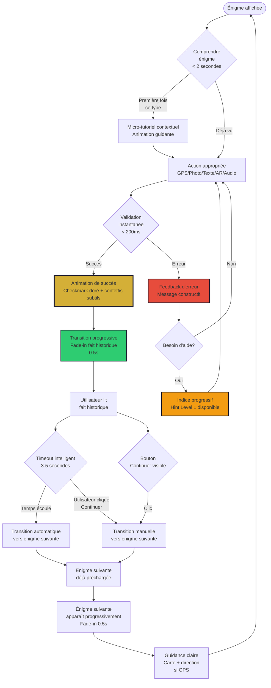
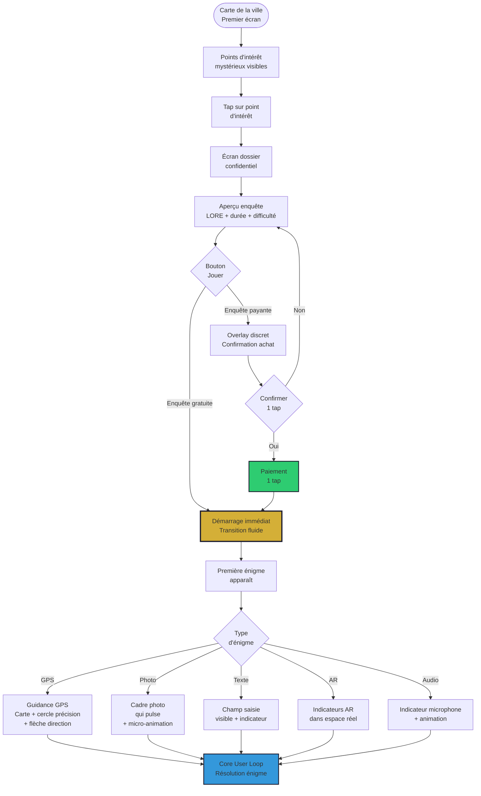
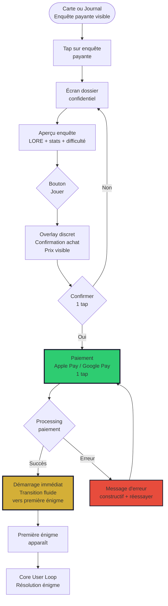
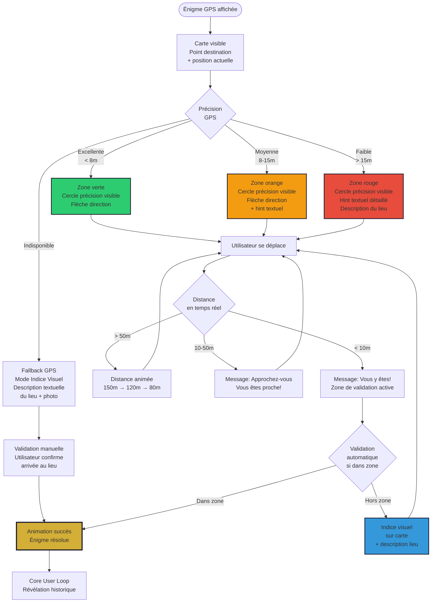
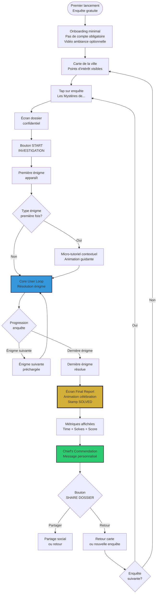
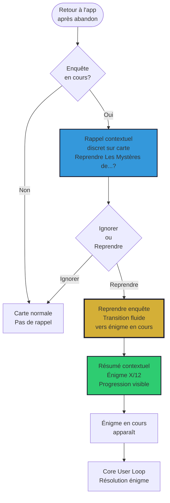

inputDocuments: ['_bmad-output/planning-artifacts/product-brief-city-detectives-2026-01-24.md', '_bmad-output/planning-artifacts/prd.md', '_bmad-output/analysis/brainstorming-session-2026-01-24.md']
mockupsSource: 'Google Stitch - 8 mockups créés le 2026-01-26'
mockupsReferences: '_bmad-output/planning-artifacts/mockups-references/'
---

# UX Design Specification city-detectives

**Author:** Sarkhan
**Date:** 2026-01-26

---

## Executive Summary

### Project Vision

City Detectives est une application mobile d'escape game urbain qui transforme la découverte de ville en expérience ludique et éducative. L'application permet aux utilisateurs de résoudre des énigmes variées (photo, géolocalisation, mots, puzzles, audio, QR codes, AR, etc.) tout en découvrant le patrimoine et l'histoire d'une ville de manière immersive.

Le problème actuel : l'application manque d'UX et d'univers cohérent. L'objectif est de créer une expérience utilisateur engageante avec un univers narratif fort (LORE des détectives) qui plonge l'utilisateur dans l'expérience, similaire à la clarté et à l'utilité de Google Maps pour la navigation.

### Target Users

**Primary Users:**

1. **"Les Reconnectés"** - Groupe d'amis (25-35 ans) cherchant une activité abordable et amusante pour se retrouver
2. **"Le Défieur"** - Joueur d'escape game (28-40 ans) cherchant des défis complexes et variés
3. **"Les Explorateurs"** - Famille avec enfants (6-16 ans) cherchant une activité éducative et amusante pour tous
4. **"Le Curieux"** - Touriste (30-60 ans) cherchant une alternative flexible aux visites guidées classiques

**User Context:**
- Utilisation en extérieur : marche dans la rue, weekends, vacances
- Appareils : principalement smartphones avec géolocalisation, contraintes avec anciens téléphones, possibilité d'utilisation sur tablettes
- Niveau technique : utilisateurs mobiles standards, familiarité avec géolocalisation (similaire à Google Maps)
- Moment de valeur : découverte d'un fait historique surprenant, résolution réussie d'une énigme, sentiment d'accomplissement

### Key Design Challenges

1. **Géolocalisation précise en extérieur** : Interface claire et intuitive pour guider l'utilisateur vers les points précis, gestion des cas de faible précision GPS, expérience similaire à Google Maps en termes de clarté de navigation. L'UX doit gérer les cas où le GPS n'est pas précis (15m au lieu de 8m) avec des indicateurs visuels clairs et adaptés au contexte d'énigme.

2. **Mode offline fluide** : Indicateurs visuels discrets du statut de connexion, gestion transparente des actions nécessitant le réseau, synchronisation automatique en arrière-plan. L'UX doit communiquer le statut de connexion sans être intrusive, avec des messages clairs quand une action nécessite le réseau.

3. **Immersion narrative vs efficacité** : Équilibre entre le LORE immersif et la possibilité de passer rapidement aux énigmes pour les utilisateurs pressés, option de sauter les éléments narratifs. Le défi est d'équilibrer clarté technique et immersion narrative.

4. **Multiplicité des modes de jeu** : Interface adaptée pour solo, groupe, famille, avec transitions claires entre les modes et gestion du pricing groupe. Système de "modes" visuels adaptatifs selon le contexte utilisateur.

5. **Optimisation batterie** : Design qui minimise la consommation tout en maintenant une expérience engageante, mode économie d'énergie disponible sans frustrer l'utilisateur.

6. **Compatibilité appareils variés** : Support des anciens smartphones et tablettes, optimisation pour différentes tailles d'écran et performances. L'UX doit refléter ces contraintes avec des indicateurs de chargement, gestion des erreurs réseau, et fallbacks visuels.

### Design Opportunities

1. **Carte interactive immersive** : Carte intégrant le LORE, la progression et la navigation, similaire à Google Maps en termes de clarté mais enrichie avec l'univers narratif. Approche en couches : carte claire (couche 1), indicateurs de précision GPS (couche 2), LORE narratif transformant la navigation en aventure (couche 3).

2. **Feedback visuel riche** : Animations et retours visuels pour célébrer les réussites (résolution d'énigmes, découvertes historiques) et maintenir l'engagement. Micro-interactions qui révèlent progressivement l'information historique — comme ouvrir un vieux livre — créant une expérience plutôt qu'un simple popup.

3. **Adaptation contextuelle** : Interface qui s'adapte selon le mode (famille vs solo), la difficulté, et le contexte d'usage (weekend, vacances). Système de thèmes/contextes avec différents "skins" UX selon le mode sélectionné :
   - **Mode Famille** : Couleurs plus vives, animations plus ludiques, système d'aide parentale visible
   - **Mode Défieur** : Interface plus sobre, focus sur la difficulté et les stats
   - **Mode Touriste** : Guide clair, informations historiques mises en avant

4. **Découverte progressive** : Révélation progressive des informations historiques pour créer du suspense et de la curiosité, moment de valeur lors de la découverte d'un fait historique.

5. **Création d'univers cohérent** : Design system basé sur une métaphore centrale — le carnet de détective. L'app est comme un carnet que l'utilisateur remplit au fil de ses découvertes, avec des éléments visuels récurrents (icônes de loupe, empreintes, indices visuels) qui renforcent le thème détective. Chaque enquête révèle une partie d'une histoire plus large, créant un sentiment de continuité narrative.

6. **Premier écran impactant** : Le premier écran que l'utilisateur voit doit créer immédiatement l'univers. Proposition : carte de la ville avec des points d'intérêt visuellement distincts, chaque point racontant une micro-histoire pour créer immédiatement l'immersion.

7. **Design Language cohérent** : Palette visuelle (couleurs sombres et mystérieuses avec accents dorés pour les découvertes), typographie évoquant l'enquête, structure de navigation claire avec éléments narratifs (ex: "Le Mystère de la Place Centrale" au lieu de "Énigme 3/12").

## Core User Experience

### Defining Experience

L'expérience centrale de City Detectives est de **résoudre des énigmes variées et dynamiques de manière fluide et engageante**, tout en découvrant l'histoire et le patrimoine de la ville. L'utilisateur interagit avec son téléphone de multiples façons (taper, prendre des photos, AR, parler, géolocalisation) pour progresser dans une enquête narrative immersive.

**Core User Loop :**
1. Découvrir une énigme dans l'enquête
2. Résoudre l'énigme via l'action appropriée (photo, géolocalisation, texte, AR, etc.) — **réponse instantanée, sans latence**
3. Transition progressive automatique vers la révélation historique (pas de "hop" brutal, mais révélation progressive du contenu suivant)
4. Découvrir un fait historique surprenant (moment de valeur) — **avec contrôle utilisateur** (possibilité de lire plus longtemps ou continuer)
5. Passer automatiquement à l'énigme suivante sans friction — **préchargée en arrière-plan pendant la résolution précédente**

**Critères de succès de l'expérience :**
- Toutes les actions sont fluides, sans latence — le jeu est dynamique (**métriques : temps de réponse < 200ms, taux d'abandon sur transitions < 5%, satisfaction perçue de la vitesse > 4.5/5**)
- L'interface est belle, agréable, donne envie de jouer — **minimaliste mais chaleureuse, pas de surcharge visuelle**
- L'utilisateur comprend immédiatement ce qu'il doit faire — **compréhension en < 2 secondes**
- L'utilisateur entre dans l'histoire et prend plaisir à découvrir — **immersion narrative dès le premier écran**
- Les transitions sont automatiques mais contrôlables — **timeout intelligent avec option d'interruption**

### Platform Strategy

**Plateforme principale :** Application mobile (iOS/Android) avec support tactile pour smartphones et tablettes.

**Contraintes techniques impactant l'UX :**
- Mode offline complet avec synchronisation transparente
- Géolocalisation précise (<10m) avec indicateurs visuels clairs
- Optimisation batterie pour permettre une enquête complète (1h-1h30) sur une charge
- Support d'appareils variés (anciens smartphones, tablettes)

**Capacités spécifiques à exploiter :**
- GPS pour énigmes géolocalisées
- Caméra pour énigmes photo
- AR pour expériences immersives
- Audio pour énigmes audio et narration
- Clavier pour énigmes texte
- Stockage local pour mode offline

**Interface requirements :**
- Belle et agréable — donne envie de jouer
- Facile à utiliser — on va droit au but
- Compréhension immédiate — l'utilisateur sait tout de suite ce qu'il doit faire
- Pas de complexité inutile — simplicité avant tout
- **Minimaliste mais chaleureuse** — chaque élément visuel sert un but : guider, célébrer, ou révéler

**Architecture technique pour fluidité :**
- **Performance native** : Rendu local instantané, pas d'attente réseau pour les validations
- **Préchargement intelligent** : L'énigme suivante est déjà chargée pendant que l'utilisateur résout la précédente
- **Optimisation des animations** : Transitions fluides à 60fps même sur anciens appareils
- **Gestion d'état réactive** : L'interface réagit immédiatement à chaque action utilisateur

### Effortless Interactions

**Interactions qui doivent être totalement fluides :**

1. **Résolution d'énigmes** : Toutes les actions (taper, photos, AR, parler, géolocalisation) doivent être fluides, sans latence, pour un jeu dynamique et varié. **L'utilisateur ne doit jamais attendre, jamais se demander "est-ce que ça fonctionne ?"**

2. **Transitions progressives automatiques** : Dès qu'une énigme est résolue, transition progressive (pas brutale) vers la révélation historique et l'énigme suivante. **Révélation progressive du contenu suivant créant une continuité narrative fluide** — l'utilisateur a le temps de voir le fait historique, puis l'énigme suivante apparaît progressivement.

3. **Contrôle utilisateur vs automatisation** : **Équilibre intelligent** — transition automatique par défaut pour maintenir le flow, mais possibilité de pause/retour si l'utilisateur le souhaite. **Timeout intelligent** : transition automatique après X secondes, mais avec option d'interruption ("Lire plus" ou "Continuer maintenant"). L'utilisateur doit se sentir en contrôle, pas emporté par l'interface.

4. **Navigation** : Comprendre immédiatement où aller, quoi faire — clarté totale comme Google Maps. **Compréhension en < 2 secondes** — pas de texte long, pas d'explications compliquées, des visuels clairs, des icônes intuitives, peut-être une micro-animation qui montre l'action attendue.

5. **Monétisation ultra-fluide** : Paiement simple, puis lancer l'énigme et jouer sans complication — parcours d'achat fluide. **Approche recommandée** : l'utilisateur voit l'enquête, clique "Jouer", et si elle est payante, un overlay discret demande confirmation (1 tap), puis l'enquête démarre immédiatement. **Pas de redirection, pas d'attente, pas de page de confirmation séparée**.

6. **Relancer une enquête** : Simple et direct — pas de complexité comme chez les concurrents.

**Élimination de frictions vs concurrents :**
- Pas de complexité pour démarrer — on va droit au but
- Pas de relance compliquée après paiement — tout est fluide
- Pas d'actions manuelles pour les transitions — automatique mais contrôlable
- Pas d'interface désagréable — belle et agréable, minimaliste mais chaleureuse

### Critical Success Moments

**Moments où l'utilisateur réalise "c'est mieux" :**
- Qualité supérieure des énigmes et de l'expérience globale
- Interface belle et agréable vs interface désagréable des concurrents
- Vraie histoire immersive vs pas de vraie histoire
- Simplicité d'usage vs complexité des concurrents
- **Fluidité absolue** — pas de latence, pas d'attente, tout est instantané

**Moments d'accomplissement utilisateur :**
- Résolution réussie d'une énigme — sentiment de réussite immédiat avec feedback visuel instantané
- Découverte d'un fait historique surprenant — moment de valeur émotionnelle avec révélation progressive
- Progression fluide dans l'enquête sans difficulté — plaisir de jouer, transitions automatiques fluides
- Complétion d'une enquête — accomplissement et envie de continuer

**Interactions critiques qui, si elles échouent, ruinent l'expérience :**
- Énigmes lentes ou avec latence — casse le dynamisme (**métrique critique : temps de réponse < 200ms**)
- Interface difficile à utiliser ou complexe — frustre l'utilisateur
- Transitions manuelles compliquées — casse le flow
- Manque de clarté sur ce qu'il faut faire — confusion (**métrique critique : compréhension en < 2 secondes**)
- **Perte de contrôle** — l'utilisateur se sent emporté par l'interface sans pouvoir interagir

**Parcours utilisateur décisifs :**
- Premier lancement d'une enquête — comprendre immédiatement (< 2 secondes)
- Achat et lancement d'une nouvelle enquête — simplicité totale, overlay discret, 1 tap, démarrage immédiat
- Résolution de la première énigme — succès immédiat et plaisir, feedback visuel instantané
- Découverte du premier fait historique — moment de valeur émotionnelle, révélation progressive

**Succès du premier utilisateur :**
- Comprendre immédiatement ce qu'il doit faire (< 2 secondes)
- Résoudre sa première énigme sans difficulté, avec feedback instantané
- Découvrir un fait historique et ressentir la valeur, avec contrôle sur le temps de lecture
- Prendre plaisir à jouer et vouloir continuer, transitions fluides et automatiques

### Experience Principles

**Principes directeurs pour toutes les décisions UX :**

1. **Fluidité absolue** : Toutes les interactions doivent être fluides, sans latence — le dynamisme du jeu est prioritaire. **Métriques de succès : temps de réponse < 200ms, taux d'abandon sur transitions < 5%, satisfaction perçue de la vitesse > 4.5/5**. Performance native avec rendu local instantané, préchargement intelligent, animations optimisées à 60fps.

2. **Simplicité radicale** : Interface belle, agréable, facile à utiliser — on va droit au but, compréhension immédiate (< 2 secondes). **Minimaliste mais chaleureuse** — chaque élément visuel sert un but : guider, célébrer, ou révéler. Pas de surcharge visuelle, pas de texte long, des visuels clairs et des icônes intuitives.

3. **Immersion narrative** : L'utilisateur doit entrer dans l'histoire et prendre plaisir à découvrir — pas juste des énigmes, une vraie expérience. **Immersion dès le premier écran** — carte de la ville avec points mystérieux, chaque point racontant une micro-histoire. LORE concis et engageant, continuité narrative fluide.

4. **Transitions automatiques intelligentes** : Dès qu'une action est complétée, transition progressive automatique vers la suite — pas de friction, mais avec contrôle utilisateur. **Révélation progressive** du contenu suivant créant une continuité narrative fluide. Timeout intelligent avec option d'interruption — l'utilisateur se sent en contrôle, pas emporté.

5. **Plaisir de jouer** : L'utilisateur doit prendre plaisir à résoudre les énigmes sans difficulté — expérience agréable avant tout. Feedback visuel instantané, célébrations des réussites, micro-interactions engageantes. Chaque résolution d'énigme doit être un moment de satisfaction immédiate.

Ces principes guident toutes les décisions de design UX pour créer une expérience supérieure aux concurrents, avec des métriques mesurables pour valider le succès.

## Desired Emotional Response

### Primary Emotional Goals

**Émotions principales que les utilisateurs doivent ressentir :**

1. **Plaisir et amusement** : Les utilisateurs doivent ressentir du plaisir, s'amuser, avoir du fun. C'est l'émotion centrale — le jeu doit être amusant et agréable. **Métriques de succès** : Mesurer le plaisir via satisfaction utilisateur, temps passé dans l'app, taux de retour, mentions du plaisir dans les avis.

2. **Accomplissement** : Après avoir atteint leur objectif principal (résoudre des énigmes, découvrir des faits historiques), les utilisateurs doivent se sentir accomplis, heureux d'avoir résolu des énigmes et découvert des choses.

3. **Immersion** : Les utilisateurs doivent être vraiment plongés dans l'histoire et l'enquête, prendre plaisir à faire des découvertes et évoluer à l'intérieur. Cette immersion est ce qui différencie City Detectives des concurrents. **Immersion multi-couches** :
   - **Couche visuelle** : Design system cohérent basé sur le carnet de détective
   - **Couche narrative** : LORE qui crée une continuité, pas juste des énigmes isolées
   - **Couche de progression** : Sentiment que le personnage détective évolue — badges, accomplissements, gamification
   - **Couche sensorielle** : Petites vidéos, petits sons, images qui donnent envie — éléments qui créent l'immersion

4. **Curiosité** : Les utilisateurs doivent ressentir de la curiosité, l'envie de savoir ce qui se passe, de découvrir, de continuer. **Révélation progressive** : Révéler progressivement les informations pour maintenir la curiosité et créer l'envie de continuer — chaque énigme résolue révèle un morceau de l'histoire.

5. **Découverte et connexion** : Les utilisateurs doivent ressentir le plaisir de découvrir la vie, d'être dehors, d'être accompagné — connexion avec la ville et son patrimoine.

**Émotion qui pousse à parler à un ami :** "J'ai passé un excellent moment" — le plaisir et l'amusement sont si forts que l'utilisateur veut partager l'expérience.

### Emotional Journey Mapping

**Parcours émotionnel à travers l'expérience utilisateur :**

1. **Découverte du produit (premier écran)** :
   - **Curiosité** : L'utilisateur doit être curieux, vouloir aller plus loin, vouloir savoir ce qui se passe
   - **Envie d'explorer** : Les images doivent donner envie d'aller là-bas, créer un désir de découverte
   - **Premier écran impactant** : Carte de la ville avec points mystérieux, chaque point avec une micro-histoire — "Ici, en 1242, un événement mystérieux..." — l'utilisateur veut savoir, veut explorer

2. **Première enquête** :
   - **Envie de continuer** : L'utilisateur veut continuer, faire plus, découvrir d'autres choses
   - **Engagement** : L'immersion commence, l'utilisateur entre dans l'histoire

3. **Expérience centrale (résolution d'énigmes)** :
   - **Accomplissement** : Sentiment de réussite lors de la résolution d'une énigme
   - **Plaisir et fun** : Amusement pendant la résolution
   - **Découverte** : Curiosité satisfaite, nouvelles connaissances acquises
   - **Curiosité** : Envie de découvrir la suite, l'énigme suivante
   - **Excitement sans anxiété** : Créer de l'excitement (curiosité, anticipation) sans stress grâce au filet de sécurité du système d'aide — l'utilisateur sait qu'il peut obtenir de l'aide s'il est bloqué

4. **Après complétion d'une enquête** :
   - **Satisfaction** : Sentiment de contentement, d'accomplissement
   - **Désir de continuer** : Envie de découvrir d'autres enquêtes, de continuer l'aventure
   - **Motivation** : Motivation pour faire une nouvelle énigme et rouvrir l'application

5. **Si quelque chose ne fonctionne pas (GPS imprécis, énigme difficile)** :
   - **Pas de frustration** : L'utilisateur ne doit pas se sentir frustré
   - **Aide progressive et intelligente** : Solutions pour éviter la frustration :
     - Pour énigme difficile : **Système d'aide progressif** — l'utilisateur essaie d'abord, puis obtient un indice subtil, puis un indice plus clair si nécessaire. L'accomplissement vient du fait qu'il a résolu l'énigme, même avec de l'aide — pas de honte à utiliser les indices
     - Pour GPS imprécis : Donner un indice pour indiquer où se trouve le point
   - **Confiance maintenue** : L'utilisateur doit garder confiance et ne pas se sentir perdu

6. **Retour à l'application** :
   - **Motivation** : L'utilisateur doit se sentir motivé pour faire une nouvelle énigme
   - **Envie de revenir** : L'application doit donner envie de revenir, de continuer l'aventure
   - **Confiance renforcée** : Chaque retour renforce la confiance — l'utilisateur sait qu'il va passer un bon moment

### Micro-Emotions

**Micro-émotions critiques identifiées :**

1. **Excitement vs Anxiété** :
   - **Objectif** : Créer de l'excitement (curiosité, anticipation) sans anxiété (stress, peur d'échouer)
   - **Approche** : Énigmes surprenantes et intéressantes, mais avec système d'aide (filet de sécurité) pour éviter l'anxiété. L'utilisateur sait qu'il peut obtenir de l'aide s'il est bloqué, donc il peut prendre des risques, être curieux, sans anxiété. L'excitement vient de la curiosité — "Qu'est-ce qui va se passer ?" — pas de la peur d'échouer.

2. **Accomplissement vs Frustration** :
   - **Objectif** : Maximiser l'accomplissement, minimiser la frustration
   - **Approche** : Système d'aide progressif intelligent (essai → indice subtil → indice plus clair si nécessaire), feedback positif immédiat. L'accomplissement vient du fait que l'utilisateur a résolu l'énigme, même avec de l'aide — pas de honte à utiliser les indices. Chaque énigme résolue renforce la confiance pour la suivante.

3. **Plaisir vs Satisfaction** :
   - **Objectif** : Créer du plaisir actif (fun, amusement) plutôt que juste de la satisfaction passive
   - **Approche** : Énigmes variées et dynamiques, interactions engageantes, moments de surprise, révélation progressive créant de la curiosité

4. **Confiance vs Confusion** :
   - **Objectif** : Bâtir la confiance, éliminer la confusion
   - **Approche** : Interface simple et claire, compréhension immédiate (< 2 secondes), guidance claire. **Construction de la confiance** : Cohérence (univers cohérent, règles claires), progression visible (l'utilisateur voit qu'il évolue), feedback positif (chaque action réussie renforce la confiance), transparence (l'utilisateur comprend toujours où il en est). La confiance se construit par la répétition d'expériences positives — chaque énigme résolue renforce la confiance pour la suivante.

### Design Implications

**Choix UX pour soutenir les réponses émotionnelles :**

**Pour créer du plaisir et de l'amusement :**
- **Facilité d'apprentissage** : L'application doit être facile à apprendre, intuitive
- **Éléments visuels engageants** : Images qui donnent envie d'aller là-bas, petites vidéos, petits sons
- **Immersion narrative** : Éléments qui donnent envie de retourner dans l'histoire — LORE, narration, univers cohérent
- **Interactions fluides** : Toutes les interactions doivent être fluides et agréables — pas de friction
- **Métriques de plaisir** : Mesurer le plaisir via satisfaction utilisateur, temps passé dans l'app, taux de retour, mentions du plaisir dans les avis

**Pour créer de l'accomplissement :**
- **Feedback visuel immédiat** : Célébrations visuelles lors de la résolution d'énigmes
- **Progression visible** : Système de gamification avec badges, évolution du personnage détective
- **Moments de révélation** : Révélation progressive des découvertes historiques créant un sentiment d'accomplissement
- **Aide progressive** : Système d'aide progressif qui maintient l'accomplissement même avec aide — pas de honte à utiliser les indices

**Pour créer de l'immersion (multi-couches) :**
- **Couche visuelle** : Design system basé sur le carnet de détective, éléments visuels récurrents
- **Couche narrative** : LORE cohérent, continuité narrative, chaque enquête révèle une partie d'une histoire plus large
- **Couche de progression** : Sentiment que le personnage détective évolue, progression visible, gamification (badges, accomplissements)
- **Couche sensorielle** : Petites vidéos, petits sons, images engageantes qui créent l'immersion

**Pour créer de la curiosité :**
- **Premier écran impactant** : Carte de la ville avec points mystérieux, chaque point racontant une micro-histoire
- **Énigmes surprenantes** : Énigmes bien recherchées, bien liées, intéressantes et surprenantes
- **Révélation progressive** : Révélation progressive des informations créant de la curiosité pour la suite — chaque énigme résolue révèle un morceau de l'histoire, créant l'envie de continuer

**Pour éviter les émotions négatives :**
- **Pas de complexité** : L'application ne doit pas être complexe — simplicité radicale
- **Beauté visuelle** : Interface belle et agréable — pas visuellement désagréable
- **Fonctionnalité technique** : Technique qui fonctionne bien — fluide et cool, pas de bugs ou de latence
- **Système d'aide intelligent** : Pour éviter frustration et confusion — indices progressifs, guidance GPS si précision insuffisante, aide progressive qui maintient l'accomplissement

**Pour créer de la confiance :**
- **Cohérence** : Univers cohérent, règles claires — l'univers détective est cohérent
- **Progression visible** : Sentiment que le personnage évolue, progression claire — l'utilisateur voit qu'il évolue
- **Feedback positif** : Chaque action réussie renforce la confiance — célébrations, accomplissements visibles
- **Transparence** : L'utilisateur comprend toujours où il en est, ce qu'il doit faire — compréhension immédiate
- **Répétition d'expériences positives** : La confiance se construit par la répétition — chaque énigme résolue renforce la confiance pour la suivante

### Emotional Design Principles

**Principes directeurs pour le design émotionnel :**

1. **Plaisir avant tout** : Chaque interaction doit créer du plaisir et de l'amusement — le fun est la priorité absolue. **Métriques** : Mesurer le plaisir via satisfaction, temps passé, taux de retour, mentions dans les avis.

2. **Immersion narrative multi-couches** : L'utilisateur doit être plongé dans l'histoire et l'enquête — univers cohérent (couche visuelle), LORE continu (couche narrative), évolution du personnage (couche progression), éléments sensoriels (couche sensorielle).

3. **Accomplissement visible et progressif** : Chaque résolution d'énigme doit créer un sentiment d'accomplissement immédiat — feedback visuel, célébrations, progression visible. L'aide progressive maintient l'accomplissement même avec assistance.

4. **Curiosité continue** : L'application doit maintenir la curiosité à chaque étape — premier écran impactant, énigmes surprenantes, révélation progressive créant l'envie de continuer.

5. **Zéro frustration** : Aucune interaction ne doit créer de frustration — système d'aide progressif intelligent, guidance claire, simplicité radicale.

6. **Confiance par la répétition** : La confiance se construit par la répétition d'expériences positives — cohérence, progression visible, feedback positif, transparence. Chaque énigme résolue renforce la confiance pour la suivante.

7. **Excitement sans anxiété** : Créer de l'excitement (curiosité, anticipation) sans stress — filet de sécurité du système d'aide permet à l'utilisateur de prendre des risques et d'être curieux sans anxiété.

Ces principes guident toutes les décisions de design UX pour créer les réponses émotionnelles désirées et éviter les émotions négatives, avec des métriques mesurables pour valider le succès émotionnel.

## UX Pattern Analysis & Inspiration

### Inspiring Products Analysis

**Catégorie d'inspiration : Jeux d'énigmes**

Bien qu'il n'y ait pas d'app spécifique similaire à City Detectives, l'analyse se base sur les patterns réussis des jeux d'énigmes et les principes UX identifiés comme critiques pour ce type d'expérience.

**Patterns de succès identifiés :**

1. **Facilité de jeu** : Navigation simple, peu de menus, aller directement au jeu — pas de friction, pas de complexité inutile

2. **Immersion immédiate** : L'univers (images, sons, vidéos) plonge immédiatement l'utilisateur dans l'ambiance — pas besoin d'explications longues, l'immersion se fait naturellement

3. **Onboarding minimaliste** : Pas de 50 000 boutons, pas de compte à créer — aller directement au jeu. Une vidéo ou un élément visuel qui met dans l'ambiance suffit pour lancer l'expérience

4. **Compréhension visuelle** : Les énigmes sont simples à comprendre — on voit directement l'approche et les astuces à faire. Pas de documentation ou de texte d'instructions ennuyeux — comprendre immédiatement en voyant

5. **Plaisir de jouer** : Ce qui fait revenir les utilisateurs, c'est le plaisir pris à jouer et découvrir des choses — les énigmes doivent être bien arrangées, ni trop difficiles ni trop faciles, intéressantes

### Transferable UX Patterns

**Patterns de navigation :**

1. **Navigation ultra-simplifiée** : 1-2 menus maximum, 3-4 boutons — aller droit au jeu, pas de hiérarchie complexe. **Application pour City Detectives** : Menu principal minimal (carte de la ville + sélection d'enquête), puis directement dans le jeu — pas de sous-menus complexes. **Métriques de succès** : Nombre de clics pour commencer une enquête (< 3 clics), temps jusqu'à la première action (< 5 secondes), taux d'abandon sur l'onboarding (< 10%)

2. **Immersion directe** : Pas d'écran d'accueil complexe, pas de configuration — aller directement dans l'expérience. **Application pour City Detectives** : Premier écran = carte de la ville avec points mystérieux, clic = début de l'enquête immédiatement. Pas d'écran d'accueil, pas de menu principal complexe — le premier écran est déjà le jeu

**Patterns d'interaction :**

1. **Compréhension visuelle immédiate** : Pour chaque type d'énigme, voir directement ce qu'il faut faire avec **indicateurs visuels spécifiques** :
   - **Voix** : Indicateur visuel clair qu'il faut parler (icône microphone, animation)
   - **Clavier** : Champ de saisie visible et intuitif, indicateur de type de réponse attendue
   - **Géolocalisation** : Carte montrant où aller, position actuelle visible, **cercle de précision GPS** montrant la zone cible
   - **Photo** : **Cadre visuel** montrant ce qu'il faut photographier, indicateur de cadrage
   - **AR** : **Indicateurs visuels dans l'espace réel** montrant où regarder, éléments superposés clairs

   **Application pour City Detectives** : Chaque énigme doit être compréhensible en < 2 secondes — pas de texte d'instructions, comprendre en voyant. **Apprentissage progressif et contextuel** : Pas de documentation globale, mais micro-indices visuels au moment où l'action est nécessaire (ex: première fois qu'une énigme photo apparaît, indicateur visuel subtil montre comment prendre la photo — puis plus besoin après)

2. **Pas de documentation** : Pas de texte d'instructions long ou ennuyeux — comprendre immédiatement par l'interface visuelle. **Application pour City Detectives** : Le texte de l'énigme pose le problème, mais l'interface montre comment interagir — pas de "mode d'emploi", pas de documentation textuelle

3. **Énigmes bien équilibrées** : Ni trop difficiles ni trop faciles — certaines énigmes difficiles pour ceux qui aiment le défi, mais majorité équilibrée. **Application pour City Detectives** : **Système de difficulté visible mais non intrusif** — indicateur subtil (1-3 étoiles) sur chaque enquête, pas de barrière (l'utilisateur peut toujours essayer), système d'aide qui s'adapte selon la difficulté perçue

**Patterns visuels :**

1. **Univers sombre et mystérieux** : Design sombre, mystérieux, qui évoque les détectives et la découverte — souvent les énigmes sont dans des univers sombres où on découvre des choses mystérieuses. **Application pour City Detectives** : Palette de couleurs sombres (noir, bleu nuit) avec accents dorés pour les découvertes, typographie évoquant l'enquête, éléments visuels mystérieux. **Adaptation contextuelle** : Mode famille peut être moins sombre, plus accessible — mode défieur plus sombre et immersif

2. **Immersion multi-sensorielle stratégique** : Images, sons, vidéos qui créent l'ambiance — pas juste du texte, mais une expérience sensorielle. **Application pour City Detectives** : **Médias avec but spécifique** — images (ambiance visuelle), sons (immersion narrative), vidéos (moments clés de l'histoire). Pas de média pour le média — chaque élément sert l'immersion et l'histoire

**Patterns d'engagement :**

1. **Plaisir de jouer** : Ce qui fait revenir, c'est le plaisir pris à jouer et découvrir — les énigmes doivent être intéressantes et bien arrangées. **Application pour City Detectives** : Focus sur le plaisir et l'amusement, énigmes variées et surprenantes, moments de découverte qui créent de la satisfaction

2. **Progression fluide** : Pas de friction, pas de redémarrage compliqué — si redémarrage nécessaire, reprendre exactement où on était. **Application pour City Detectives** : Sauvegarde automatique continue, reprise transparente, pas de perte de progression

### Anti-Patterns to Avoid

**Patterns à éviter identifiés :**

1. **Complexité de navigation** : Éviter les menus multiples, les hiérarchies complexes, les nombreux boutons — cela crée de la confusion et de la friction. **À éviter pour City Detectives** : Pas de menus complexes, pas de sous-menus profonds, pas de configuration compliquée

2. **Onboarding lourd** : Éviter les 50 000 boutons, les comptes à créer obligatoirement, les écrans d'explication longs — cela casse l'immersion immédiate. **À éviter pour City Detectives** : Pas de compte obligatoire au démarrage, pas d'écrans d'onboarding multiples, pas de configuration complexe

3. **Documentation textuelle** : Éviter les textes d'instructions longs et ennuyeux qui expliquent comment tout fonctionne — cela casse le flow et la compréhension immédiate. **À éviter pour City Detectives** : Pas de "mode d'emploi", pas de documentation textuelle longue — comprendre en voyant, pas en lisant

4. **Friction dans la reprise** : Éviter de perdre la progression, de devoir recommencer depuis le début — cela crée de la frustration. **À éviter pour City Detectives** : Pas de perte de progression, pas de redémarrage depuis le début — sauvegarde continue, reprise transparente

5. **Gestion d'erreurs restrictive** : Éviter les erreurs qui cassent l'énigme, qui empêchent de continuer — cela casse l'immersion et le plaisir. **À éviter pour City Detectives** : Gestion d'erreurs la moins restrictive possible, ne pas casser l'énigme en cours, permettre de continuer même en cas d'erreur. **Fallbacks gracieux** : Si GPS imprécis → indice visuel sur la carte, si photo pas bonne → montrer visuellement ce qui manque, si AR ne fonctionne pas → basculer vers mode alternatif. Jamais de blocage total.

### Design Inspiration Strategy

**Stratégie d'inspiration pour City Detectives :**

**Ce qu'il faut adopter :**

1. **Navigation ultra-simplifiée** : 1-2 menus maximum, 3-4 boutons — parce que cela soutient l'expérience centrale de fluidité et de simplicité radicale. **Métriques** : < 3 clics pour commencer une enquête, < 5 secondes jusqu'à première action, < 10% taux d'abandon onboarding

2. **Immersion directe** : Aller directement au jeu, pas d'écran d'accueil complexe — parce que cela s'aligne avec l'objectif d'immersion narrative immédiate. Premier écran = carte de la ville, clic = enquête commence

3. **Compréhension visuelle avec indicateurs spécifiques** : Chaque énigme compréhensible en < 2 secondes, pas de documentation — parce que cela soutient l'objectif de simplicité radicale et de plaisir de jouer. Indicateurs visuels spécifiques par type d'énigme (cadre photo, cercle GPS, indicateurs AR)

4. **Apprentissage progressif et contextuel** : Micro-indices visuels au moment où l'action est nécessaire — parce que cela évite la documentation tout en guidant l'utilisateur

5. **Univers sombre et mystérieux adaptatif** : Design sombre, mystérieux, détectives — parce que cela soutient l'objectif émotionnel d'immersion et de curiosité. Adaptation selon modes (famille moins sombre, défieur plus sombre)

6. **Immersion multi-sensorielle stratégique** : Images, sons, vidéos avec but spécifique — parce que cela crée l'immersion narrative multi-couches désirée. Chaque média sert un but (ambiance, narration, moments clés)

7. **Fallbacks gracieux** : Gestion d'erreurs non restrictive avec alternatives — parce que cela maintient le plaisir et l'immersion même en cas de problème technique

**Ce qu'il faut adapter :**

1. **Patterns de jeux d'énigmes** : Adapter pour le contexte mobile extérieur (géolocalisation, photos, AR) — modifier pour les contraintes techniques (offline, batterie, GPS). Indicateurs visuels spécifiques pour chaque type d'énigme

2. **Univers sombre** : Adapter selon les modes (famille vs solo) — mode famille peut être moins sombre, plus accessible, mode défieur plus sombre et immersif

3. **Compréhension visuelle** : Adapter pour les différents types d'énigmes avec indicateurs visuels spécifiques — chaque type nécessite des indicateurs différents (cadre photo, cercle GPS, indicateurs AR, etc.)

4. **Système de difficulté** : Adapter avec indicateur visible mais non intrusif (1-3 étoiles), pas de barrière, aide adaptative selon difficulté perçue

**Ce qu'il faut éviter :**

1. **Complexité de navigation** : Éviter les menus multiples, hiérarchies complexes — cela entre en conflit avec l'objectif de simplicité radicale

2. **Onboarding lourd** : Éviter les comptes obligatoires, écrans multiples — cela casse l'immersion immédiate

3. **Documentation textuelle** : Éviter les textes d'instructions longs — cela casse le flow et la compréhension immédiate. Utiliser apprentissage progressif et contextuel à la place

4. **Gestion d'erreurs restrictive** : Éviter les erreurs qui cassent l'énigme — cela casse le plaisir et l'immersion. Utiliser fallbacks gracieux à la place

Cette stratégie guide les décisions de design UX en s'inspirant des patterns réussis tout en gardant City Detectives unique avec son univers narratif, ses contraintes techniques spécifiques, et ses indicateurs visuels adaptés à chaque type d'énigme.

## Design System Foundation

### Design System Choice

**Choix : Material Design 3 (Flutter) avec personnalisation approfondie**

City Detectives utilisera Material Design 3 comme fondation, avec une personnalisation approfondie pour créer l'univers détective unique (couleurs sombres, accents dorés, typographie évoquant l'enquête).

### Rationale for Selection

**Facteurs de décision :**

1. **Équilibre vitesse/unicité** : Material Design 3 offre un équilibre optimal — composants Flutter prêts à l'emploi pour la vitesse de développement, avec possibilité de personnalisation approfondie pour créer l'univers détective unique

2. **Expertise design limitée** : En tant que développeur front-end sans expertise design, Material Design 3 fournit une base solide et éprouvée. La personnalisation peut être guidée par l'IA pour créer un design cohérent et agréable sans nécessiter d'expertise design approfondie

3. **Timeline flexible** : Avec un timeline large et une approche vibecoding, la personnalisation peut être progressive — commencer avec les composants de base, puis personnaliser progressivement pour créer l'univers détective

4. **Pas de guidelines de marque existantes** : Liberté totale pour créer l'univers détective depuis zéro, avec Material Design 3 comme fondation solide

5. **Maintenance à long terme** : Material Design 3 est maintenu par Google avec mises à jour régulières, réduisant la charge de maintenance technique. Toutes les applications nécessitent de la maintenance, mais avoir une base maintenue par une grande organisation réduit les risques

6. **Adaptation contextuelle** : Le système de thèmes Flutter permet facilement de créer plusieurs thèmes (Mode Famille, Mode Défieur, Mode Touriste) tout en gardant la cohérence du design system

7. **Accessibilité intégrée** : Material Design 3 inclut l'accessibilité par défaut, important pour une application mobile utilisée en extérieur par des utilisateurs variés

8. **Performance optimisée** : Les composants Material Design 3 sont optimisés pour Flutter, avec animations fluides à 60fps et gestion efficace des rebuilds

### Implementation Approach

**Approche d'implémentation progressive :**

1. **Phase 1 : Fondation Material Design 3 (MVP)**
   - Intégration de Material Design 3 dans Flutter
   - Configuration des thèmes de base (clair/sombre) avec personnalisation minimale
   - Utilisation des composants standards Material pour le MVP
   - **Objectif** : Avoir une base fonctionnelle rapidement

2. **Phase 2 : Personnalisation de l'univers détective (V1.0)**
   - **Design Tokens personnalisés** :
     - **Palette de couleurs** : Personnalisation des couleurs Material pour créer l'univers sombre et mystérieux
       - Couleurs primaires : Tons sombres (noir, bleu nuit profond #1a1a2e)
       - Couleurs d'accent : Or/doré (#d4af37) pour les découvertes et moments de valeur
       - Couleurs de surface : Noir avec variations (#0a0a0a, #1a1a1a) pour la profondeur
       - Error/Success : Adaptations pour l'univers détective
     - **Typographie** : Personnalisation de la typographie Material pour évoquer l'enquête (sans-serif moderne mais avec caractère)
     - **Espacement** : Système d'espacement cohérent basé sur Material mais adapté
     - **Formes** : Bordures arrondies modérées, élévations subtiles
   - **Composants Material personnalisés** :
     - Buttons : Style personnalisé pour l'univers détective (couleurs, formes, animations)
     - Cards : Style personnalisé pour les énigmes et enquêtes (bordures, ombres, animations)
     - Navigation : Style personnalisé pour la navigation simplifiée (1-2 menus, 3-4 boutons)
     - Inputs : Style personnalisé pour les énigmes texte (champs de saisie avec indicateurs visuels)
   - **Aide IA pour personnalisation** : Utilisation de l'IA pour générer les palettes de couleurs cohérentes, créer les composants personnalisés avec design cohérent, valider l'accessibilité

3. **Phase 3 : Composants personnalisés (V1.0)**
   - **Composants complètement personnalisés** créés comme widgets Flutter qui s'intègrent avec le système de thèmes Material :
     - **Carte interactive** : Composant personnalisé pour la carte de la ville avec points mystérieux, intégrant LORE et progression
     - **Indicateurs GPS** : Composants personnalisés pour les indicateurs de précision GPS (cercles de précision, animations fluides à 60fps)
     - **Cadres photo** : Composants personnalisés pour les énigmes photo (cadres visuels montrant ce qu'il faut photographier)
     - **Indicateurs AR** : Composants personnalisés pour les énigmes AR (indicateurs dans l'espace réel, éléments superposés clairs)
     - **Système de progression** : Composants personnalisés pour la gamification (badges, progression détective, collection)
   - **Performance** : S'assurer que les composants personnalisés suivent les mêmes patterns de performance Material — pas de rebuilds inutiles, animations fluides à 60fps, gestion efficace de l'état

4. **Phase 4 : Thèmes contextuels (V2.0)**
   - **Système de thèmes Flutter** : Utilisation du système de thèmes Material pour créer plusieurs variantes avec variations subtiles
   - **Thème Mode Famille** : Adaptation du thème (couleurs plus vives, moins sombre, animations plus ludiques, plus accessible)
   - **Thème Mode Défieur** : Adaptation du thème (plus sombre, plus immersif, focus sur difficulté et stats)
   - **Thème Mode Touriste** : Adaptation du thème (guide clair, informations historiques mises en avant)
   - **Cohérence** : Tous les thèmes gardent la même structure Material mais avec variations subtiles pour s'adapter au contexte

**Métriques de succès du design system :**
- **Temps de développement** : Temps réduit pour créer de nouveaux écrans grâce aux composants réutilisables
- **Cohérence visuelle perçue** : Cohérence visuelle maintenue à travers l'application
- **Satisfaction utilisateur** : Satisfaction utilisateur sur le design (> 4/5 étoiles)
- **Performance** : Animations fluides à 60fps, pas de dégradation de performance avec les composants personnalisés

### Customization Strategy

**Stratégie de personnalisation :**

1. **Design Tokens personnalisés**
   - **Couleurs** : Palette sombre et mystérieuse avec accents dorés
     - Primary : Bleu nuit profond (#1a1a2e)
     - Secondary : Or/doré (#d4af37)
     - Surface : Noir avec variations (#0a0a0a, #1a1a1a)
     - Error/Success : Adaptations pour l'univers détective
   - **Typographie** : Police sans-serif moderne mais avec caractère, évoquant l'enquête
   - **Espacement** : Système d'espacement cohérent basé sur Material mais adapté
   - **Formes** : Bordures arrondies modérées, élévations subtiles

2. **Composants Material personnalisés**
   - **Buttons** : Style personnalisé pour l'univers détective (couleurs, formes, animations)
   - **Cards** : Style personnalisé pour les énigmes et enquêtes (bordures, ombres, animations)
   - **Navigation** : Style personnalisé pour la navigation simplifiée (1-2 menus, 3-4 boutons)
   - **Inputs** : Style personnalisé pour les énigmes texte (champs de saisie avec indicateurs visuels)

3. **Composants complètement personnalisés**
   - **Intégration avec système de thèmes** : Créer les composants personnalisés comme widgets Flutter qui s'intègrent avec le système de thèmes Material pour garder la cohérence
   - **Carte interactive** : Composant unique pour la carte de la ville avec points mystérieux, intégrant LORE et progression
   - **Indicateurs GPS** : Composants uniques pour les indicateurs de précision GPS (cercles de précision, animations fluides)
   - **Système d'énigmes** : Composants uniques pour chaque type d'énigme (photo, AR, audio, géolocalisation) avec indicateurs visuels spécifiques
   - **Système de progression** : Composants uniques pour la gamification (badges, progression détective, collection)
   - **Performance** : Suivre les mêmes patterns de performance Material — pas de rebuilds inutiles, animations fluides à 60fps

4. **Thèmes contextuels**
   - **Système de thèmes Flutter** : Utilisation du système de thèmes Material pour créer plusieurs variantes
   - **Variations subtiles** : Tous les thèmes gardent la même structure Material mais avec variations subtiles pour s'adapter au contexte
   - **Mode Famille** : Thème adapté (couleurs plus vives, moins sombre, animations plus ludiques, plus accessible)
   - **Mode Défieur** : Thème adapté (plus sombre, plus immersif, focus sur difficulté)
   - **Mode Touriste** : Thème adapté (guide clair, informations historiques mises en avant)

5. **Personnalisation progressive**
   - **MVP** : Utiliser Material Design 3 standard avec personnalisation minimale (couleurs de base)
   - **V1.0** : Personnalisation approfondie (typographie, formes, composants personnalisés)
   - **V2.0+** : Thèmes contextuels et composants avancés

6. **Aide IA pour la personnalisation**
   - Génération de palettes de couleurs cohérentes avec l'univers détective
   - Création de composants personnalisés avec design cohérent et accessible
   - Validation de l'accessibilité et de la cohérence visuelle
   - Génération de variantes de thèmes pour les différents modes

Cette stratégie permet de créer un design system unique et cohérent pour City Detectives tout en bénéficiant de la vitesse de développement et de la maintenance de Material Design 3, avec une approche progressive qui permet d'itérer et d'apprendre.

## Visual Design Foundation

### Color System

**Palette de couleurs pour l'univers détective :**

**Couleurs principales (univers sombre et mystérieux) :**
- **Primary (Bleu nuit profond)** : #1a1a2e — Couleur principale pour l'univers détective, sombre et mystérieux
- **Surface (Noir avec variations)** : #0a0a0a (fond principal), #1a1a1a (surfaces élevées) — Profondeur et hiérarchie visuelle
- **Background (Noir profond)** : #000000 — Fond principal pour l'immersion maximale

**Couleurs d'accent (découvertes et moments de valeur) :**
- **Secondary (Or/doré)** : #d4af37 — Accents pour les découvertes historiques, moments de valeur, célébrations
- **Accent Light (Or clair)** : #f4d03f — Variante plus claire pour les éléments interactifs importants

**Couleurs sémantiques (adaptées à l'univers détective) :**
- **Success (Découverte réussie)** : #2ecc71 (vert émeraude) ou adaptation dorée #d4af37 — Pour les énigmes résolues, découvertes
- **Error (Erreur/Blocage)** : #e74c3c (rouge) ou adaptation sombre — Pour les erreurs, mais non frustrant
- **Warning (Attention/Indice)** : #f39c12 (orange) ou adaptation dorée — Pour les indices, avertissements
- **Info (Information historique)** : #3498db (bleu) ou adaptation bleu nuit — Pour les informations, guidance

**Adaptation contextuelle selon les modes :**
- **Mode Famille** : Couleurs plus vives, moins sombres — Primary plus clair (#2a2a4e), accents plus colorés
- **Mode Défieur** : Plus sombre et immersif — Primary plus sombre (#0a0a1e), accents plus subtils
- **Mode Touriste** : Guide clair — Primary modéré (#1a2a3e), accents dorés plus visibles

**Accessibilité :**
- **Contraste minimum** : Ratio de contraste 4.5:1 pour le texte normal, 3:1 pour le texte large
- **Contraste pour l'univers sombre** : Texte clair sur fond sombre (#ffffff ou #f5f5f5 sur #0a0a0a) — contraste élevé pour la lisibilité
- **Validation des contrastes** : Tous les combinaisons de couleurs validées pour l'accessibilité WCAG 2.1 Level AA minimum

### Typography System

**Système typographique moderne et mystérieux :**

**Ton général :** Moderne et mystérieux — typographie qui évoque l'enquête, sans-serif moderne mais avec caractère

**Polices (liberté totale, tant qu'on a le bon ton) :**
- **Primary Font (Sans-serif moderne avec caractère)** : Police sans-serif moderne qui évoque l'enquête et le mystère
  - Suggestions : Inter, Roboto, ou police personnalisée avec caractère
  - Caractéristiques : Lisible, moderne, mais avec une touche de mystère (peut-être légèrement condensée ou avec des détails subtils)
- **Secondary Font (Optionnel)** : Pour les éléments spéciaux (titres d'enquêtes, LORE) — peut être la même avec variations de poids

**Hiérarchie typographique :**
- **H1 (Titres d'enquêtes)** : 32-36px, Bold, pour les titres principaux d'enquêtes
- **H2 (Sections)** : 24-28px, Semi-bold, pour les sections d'enquêtes
- **H3 (Sous-sections)** : 20-24px, Medium, pour les sous-sections
- **Body Large (Contenu long-form principal)** : 18px, Regular, pour les découvertes historiques, LORE, contenu long-form
- **Body (Texte standard)** : 16px, Regular, pour le texte standard
- **Body Small (Métadonnées)** : 14px, Regular, pour les métadonnées, labels
- **Caption (Légendes)** : 12px, Regular, pour les légendes, hints

**Espacement typographique :**
- **Line Height** : 1.5-1.6 pour le contenu long-form (lisibilité optimale), 1.4 pour les titres
- **Letter Spacing** : Normal pour le body, légèrement augmenté pour les titres (0.5-1px) pour le caractère
- **Word Spacing** : Normal pour la lisibilité

**Accessibilité :**
- **Taille minimale** : 14px minimum pour tout texte (12px pour captions uniquement)
- **Contraste** : Texte clair (#ffffff ou #f5f5f5) sur fond sombre (#0a0a0a) — contraste élevé pour la lisibilité
- **Redimensionnement** : Support du redimensionnement de texte système pour l'accessibilité

**Utilisation pour contenu long-form :**
- **Découvertes historiques** : Body Large (18px) avec line height 1.6 pour la lisibilité optimale
- **LORE narratif** : Body Large (18px) avec espacement généreux pour l'immersion
- **Explications** : Body (16px) avec line height 1.5 pour la clarté

### Spacing & Layout Foundation

**Fondations d'espacement et de layout :**

**Sensation globale du layout :**
- **Aéré et spacieux** : Layout généreux en espace blanc pour la clarté — pas de surcharge visuelle, interface claire

**Système d'espacement :**
- **Unité de base** : **8px** (système commun et standard) — tous les espacements sont des multiples de 8px
  - **4px** : Espacement très serré (éléments liés)
  - **8px** : Espacement standard (espacement de base)
  - **16px** : Espacement moyen (entre sections)
  - **24px** : Espacement large (entre grandes sections)
  - **32px** : Espacement très large (marges principales)
  - **48px** : Espacement extra-large (sections majeures)

**Espace blanc généreux :**
- **Marges** : Généreuses (24-32px) pour la clarté et l'aération
- **Padding** : Généreux (16-24px) dans les composants pour la respiration
- **Espacement entre éléments** : Généreux (16-24px) pour éviter la surcharge visuelle
- **Principe** : Mieux vaut trop d'espace que pas assez — clarté avant tout

**Système de grille :**
- **Approche** : Grille flexible adaptée au mobile
- **Colonnes** : Système de colonnes flexible (pas de grille rigide) — adaptatif selon la taille d'écran
- **Gutters** : 16px entre colonnes (espacement généreux)
- **Marges** : 16-24px sur les côtés (marges généreuses pour la clarté)
- **Principe** : Sans surcharger le visuel — simplicité et clarté avant tout

**Layout principles :**
1. **Clarté avant tout** : Espace blanc généreux pour éviter la surcharge visuelle — interface claire et compréhensible
2. **Hiérarchie visuelle** : Utilisation de l'espacement pour créer la hiérarchie — éléments importants avec plus d'espace
3. **Respiration** : Chaque élément a de l'espace pour respirer — pas de surcharge, pas de compression
4. **Adaptabilité** : Layout adaptatif selon la taille d'écran et le mode (famille/solo/défieur)

**Densité de contenu :**
- **Contenu long-form** : Espacement généreux entre paragraphes (24px) pour la lisibilité
- **Sections** : Espacement large entre sections (32px) pour la clarté
- **Éléments interactifs** : Zones de toucher généreuses (minimum 44x44px) avec espacement autour

### Accessibility Considerations

**Considérations d'accessibilité :**

**Contraste :**
- **Texte sur fond sombre** : Texte clair (#ffffff ou #f5f5f5) sur fond sombre (#0a0a0a) — contraste élevé (ratio > 4.5:1)
- **Texte sur accents** : Texte sombre sur accents dorés — validation du contraste
- **Éléments interactifs** : Contraste suffisant pour la visibilité et l'accessibilité

**Tailles de police :**
- **Minimum** : 14px pour tout texte (12px pour captions uniquement)
- **Recommandé** : 16px pour le body, 18px pour le contenu long-form
- **Redimensionnement** : Support du redimensionnement de texte système

**Zones de toucher :**
- **Minimum** : 44x44px pour tous les éléments interactifs (guidelines d'accessibilité mobile)
- **Espacement** : Espacement généreux autour des éléments interactifs pour éviter les erreurs de toucher

**Couleurs et accessibilité :**
- **Pas de dépendance à la couleur seule** : Utilisation d'icônes, formes, et texte en plus des couleurs pour communiquer l'information
- **Indicateurs visuels multiples** : Pour les états (succès, erreur), utiliser couleur + icône + texte

**Navigation et accessibilité :**
- **Clarté** : Navigation simple et claire (1-2 menus, 3-4 boutons) pour faciliter l'accessibilité
- **Feedback** : Feedback visuel clair pour toutes les actions — important pour l'accessibilité

Cette fondation visuelle crée un univers détective moderne et mystérieux tout en maintenant la clarté, l'accessibilité, et l'espace généreux pour une interface claire et agréable.

## Design Direction Decision

### Design Directions Explored

Huit directions de design ont été explorées dans le document `ux-design-directions.html`, couvrant différentes approches visuelles :
1. Carte Immersive Plein Écran
2. Découverte par Cartes
3. Narratif Linéaire
4. Carnet de Détective Minimaliste
5. Dashboard Jeu d'Abord
6. Hybride Split-Screen
7. Progression Temporelle (Timeline)
8. Adaptatif Contextuel

### Chosen Direction

**Direction choisie : Combinaison hybride inspirée des mockups Google Stitch**

Après création de mockups avec Google Stitch, la direction choisie combine les meilleurs éléments de plusieurs approches :

**Éléments clés de la direction choisie :**

1. **Carte Interactive avec Progression Visible** (inspirée de Direction 1 + mockups)
   - Carte plein écran avec points d'intérêt mystérieux
   - Indicateurs de progression d'investigation visibles en haut
   - Navigation bottom bar claire (Map, Journal, Profile, Scan)
   - Points d'intérêt avec états visuels (UNSOLVED, LOCKED, SOLVED)

2. **Journal/Evidence Collection** (inspirée de Direction 2 + mockups)
   - Interface basée sur des cartes d'évidence collectées
   - Filtres clairs (All Evidence, Clues, Heritage)
   - Layout en grille 2 colonnes avec espacement généreux
   - Contenu long-form bien géré (notes, descriptions historiques)

3. **Dossiers Confidentiels et Immersion Narrative** (inspirée de Direction 4 + mockups)
   - Métaphore du dossier confidentiel pour les enquêtes
   - Design sombre et mystérieux avec éléments thématiques (stamps, empreintes)
   - Typographie qui évoque l'enquête (serif pour titres, sans-serif pour contenu)
   - Éléments visuels récurrents (loupes, empreintes, dossiers)

4. **Gamification Discrète** (inspirée de Direction 5 + mockups)
   - Progression visible (Case Completion, XP, Level)
   - Badges et accomplissements (Earned Badges)
   - Leaderboard (Precinct Top Brass) pour engagement
   - Stats et métriques claires (Time, Solves, Score)

5. **Interactions Contextuelles** (inspirée de Direction 8 + mockups)
   - Layout qui s'adapte selon le type d'énigme
   - Énigme GPS → Carte avec indicateurs de précision
   - Énigme photo → Interface photo optimisée
   - Énigme inspection → Modes de visualisation (Standard Light, UV Mode)
   - Énigme texte → Champ de saisie avec validation

### Design Rationale

**Pourquoi cette direction fonctionne :**

1. **Alignement avec les fondations visuelles** : Design sombre et mystérieux, layout aéré et spacieux, typographie claire, contraste élevé — tous les éléments des mockups s'alignent parfaitement avec les fondations définies.

2. **Immersion narrative forte** : Les éléments de dossier confidentiel, les stamps "SOLVED", les empreintes, et la typographie thématique créent une immersion narrative immédiate dès le premier écran.

3. **Clarté et simplicité** : Navigation simple (bottom bar), filtres clairs, labels explicites, instructions contextuelles — l'interface est compréhensible en < 2 secondes.

4. **Variété des interactions** : La combinaison carte + journal + dossiers permet de gérer tous les types d'énigmes (GPS, photo, texte, AR, inspection) avec des interfaces optimisées pour chaque type.

5. **Gamification équilibrée** : Progression, badges, et leaderboard sont présents mais discrets, ne distrayant pas de l'immersion narrative tout en encourageant l'engagement.

6. **Contenu long-form bien géré** : Les cartes d'évidence, les notes, et les descriptions historiques sont présentées avec espacement généreux et typographie lisible, permettant une lecture confortable.

### Implementation Approach

**Phase 1 : Structure de base (MVP)**
- Carte interactive avec points d'intérêt
- Navigation bottom bar (Map, Journal, Profile)
- Écran de dossier confidentiel pour enquêtes
- Écran de journal avec filtres et cartes d'évidence

**Phase 2 : Interactions contextuelles (V1.0)**
- Indicateurs GPS clairs (cercles de précision, flèches, distance animée)
- Interfaces optimisées par type d'énigme (GPS, photo, texte, AR, inspection)
- Transitions automatiques intelligentes entre énigmes
- Système de hints progressif

**Phase 3 : Micro-interactions et feedback (V1.0)**
- Animations de célébration (succès, badges, progression)
- Feedback visuel instantané sur toutes les interactions
- Micro-animations guidantes pour première utilisation
- Révélation progressive des découvertes historiques

**Phase 4 : Gamification et social (V2.0)**
- Leaderboard complet avec animations
- Système de badges avancé
- Partage de dossiers
- Progression détaillée avec stats

### Améliorations UX Identifiées

**Analyse détaillée disponible dans :** `ux-mockup-analysis.md`

**Mockups HTML de référence :** `mockups-references/`
- `case-closed-summary.html` : Écran Final Report avec effet papier et stamp "RESOLVED"
- Voir `mockups-references/README.md` pour plus de détails

**Améliorations prioritaires à implémenter :**

1. **Indicateurs GPS clairs** (Priorité 1)
   - Cercle de précision GPS autour des points
   - Flèche de direction animée
   - Distance en temps réel avec animation
   - Hints contextuels si GPS imprécis

2. **Transitions automatiques intelligentes** (Priorité 1)
   - Révélation progressive du fait historique après résolution
   - Timeout intelligent avec contrôle utilisateur
   - Préchargement de l'énigme suivante en arrière-plan

3. **Feedback visuel instantané** (Priorité 1)
   - États pressed sur tous les boutons
   - Animations de succès immédiates (< 200ms)
   - Indicateurs de chargement discrets

4. **Micro-animations guidantes** (Priorité 2)
   - Pulse pour attirer l'attention sur éléments interactifs
   - Instructions contextuelles animées pour première utilisation
   - Animations de découverte pour nouvelles preuves

5. **Gestion d'erreurs non restrictive** (Priorité 2)
   - Messages constructifs au lieu de "Erreur"
   - Fallbacks gracieux (AR → photo, GPS → hint visuel)
   - Options d'aide toujours disponibles

Cette direction de design combine le meilleur des mockups créés avec les principes UX établis, créant une expérience utilisateur fluide, immersive et engageante.

## 2. Core User Experience

### 2.1 Defining Experience

**L'expérience centrale définissante de City Detectives :**

"Résoudre des énigmes variées et dynamiques en découvrant une ville, avec une histoire immersive qui enseigne le patrimoine — tout cela de manière fluide et automatique, sans friction."

**Action centrale que les utilisateurs décriront à leurs amis :**
"J'ai résolu des énigmes en découvrant la ville et j'ai appris plein de choses sur son histoire ! C'était amusant et intéressant."

**Interaction qui fait que les utilisateurs se sentent accomplis :**
Résoudre une énigme un peu complexe qui nécessite de réfléchir, puis découvrir automatiquement un fait historique surprenant sur la ville — sentiment d'accomplissement intellectuel et de découverte.

**Si on réussit UNE chose parfaitement :**
La fluidité absolue de la résolution d'énigmes — comprendre immédiatement ce qu'il faut faire (< 2 secondes), résoudre l'énigme de manière fluide, transition automatique vers la révélation historique et l'énigme suivante, sans friction, sans attente, tout est dynamique.

### 2.2 User Mental Model

**Comment les utilisateurs résolvent actuellement ce problème :**
- Découvrir une ville en jouant dans la ville — combinaison de jeu et découverte
- Peuvent payer beaucoup pour cette activité, sans garantie de bien découvrir la ville
- Peuvent ne découvrir qu'une partie de la ville

**Modèle mental qu'ils apportent :**
- Attente : c'est cool, s'amuser, découvrir de nouvelles choses
- Modèle mental : **entre un jeu mobile et une app de découverte** — combinaison de gameplay et d'apprentissage. L'interface doit refléter cette combinaison : éléments de jeu (progression, badges, célébrations) avec la clarté d'une app de découverte (carte claire, guidance, informations historiques)

**Attentes sur le fonctionnement :**
- Interface classique et compréhensible (comme les apps GAFA — facilité d'utilisation, UX/UI établie)
- Comprendre immédiatement ce qu'il faut faire
- Expérience fluide et dynamique

**Où ils risquent d'être confus ou frustrés :**
- Si les énigmes sont trop complexes — confusion et frustration
- S'ils se perdent — ne savent pas où aller
- S'ils ne peuvent pas faire les choses — blocage technique (GPS imprécis, AR ne fonctionne pas, etc.)
- **Solutions** : Système d'aide progressif, guidance claire, fallbacks gracieux

**Solutions existantes (Questo) :**

**Ce qu'ils aiment :**
- C'était sympa, on s'est bien amusé
- On est allé dans des endroits de la ville où on ne serait pas allé autrement

**Ce qu'ils n'aiment pas :**
- Énigmes pas trop simples (pas assez variées ou intéressantes)
- Histoire mauvaise — pas de fun, pas d'immersion
- N'ont rien appris sur la ville — manque de valeur éducative
- Manque d'immersion — ne rentrent pas dans l'histoire

**Raccourcis ou contournements :**
- Utilisent les moyens disponibles — si quelque chose ne fonctionne pas, ils essaient autrement ou abandonnent

**Ce qui rend les solutions existantes magiques ou terribles :**
- **Magique** : Immersion, énigmes intéressantes, LORE intéressant
- **Terrible** : Manque d'immersion, énigmes pas intéressantes, LORE pas intéressant, pas de découverte réelle de la ville

### 2.3 Success Criteria

**Ce qui fait dire aux utilisateurs "ça fonctionne" :**
- Toujours revenir — envie de continuer à utiliser l'app
- Le fun, le plaisir — s'amuser pendant l'expérience
- Énigmes intéressantes — variées, surprenantes, bien arrangées
- Histoire immersive — LORE intéressant, riche, qui crée l'immersion

**Quand ils se sentent intelligents ou accomplis :**
- Quand ils résolvent les énigmes, surtout si c'est un peu complexe et qu'ils ont dû réfléchir
- Quand ils découvrent un fait historique surprenant — sentiment d'avoir appris quelque chose
- Quand ils progressent dans l'enquête — sentiment d'avancement et d'accomplissement

**Feedback qui leur indique qu'ils font bien :**
- Montrer qu'ils avancent dans l'énigme — progression visible
- Montrer où aller pour la prochaine énigme — guidance claire
- Feedback visuel immédiat lors de la résolution — célébrations, animations
- Révélation progressive des découvertes historiques — moment de valeur

**Vitesse :**
- Rapide, dynamique — ne pas perdre la dynamique du jeu
- Temps de réponse < 200ms pour toutes les interactions
- Compréhension immédiate (< 2 secondes) de ce qu'il faut faire

**Ce qui doit se passer automatiquement :**
- Changement d'énigme — transition automatique vers l'énigme suivante
- Indication du nouveau lieu pour la prochaine énigme — guidance automatique
- Révélation historique — transition automatique vers la découverte après résolution
- **Tout doit être automatique, sans friction** — l'enquête doit se dérouler naturellement

**Indicateurs de succès :**
1. **Taux de retour** : Utilisateurs qui reviennent régulièrement (> 60% après 7 jours)
2. **Taux de complétion** : > 80% des utilisateurs complètent une enquête commencée
3. **Satisfaction** : > 4.5/5 étoiles, mentions du plaisir et de l'immersion dans les avis
4. **Temps de compréhension** : < 2 secondes pour comprendre ce qu'il faut faire
5. **Fluidité perçue** : Satisfaction perçue de la vitesse > 4.5/5
6. **Métriques de fluidité** : Temps jusqu'à première action (< 5 secondes), taux d'abandon sur première énigme (< 10%), satisfaction perçue de la fluidité (> 4.5/5)

### 2.4 Novel UX Patterns

**Analyse des patterns :**

**Patterns établis utilisés :**
- **Interface classique** : Design mobile classique, UX/UI établie comme les apps GAFA (facilité d'utilisation)
- **Patterns de jeux mobiles** : Inspirations des jeux mobiles car City Detectives est entre un jeu et une app
- **Navigation simplifiée** : 1-2 menus, 3-4 boutons — patterns établis de simplicité

**Nouvelles interactions nécessitant de l'éducation utilisateur :**
- **Différentes façons d'utiliser le téléphone** selon les énigmes :
  - **Audio** : Utiliser le microphone pour les énigmes audio
  - **Texte** : Taper avec le clavier pour les énigmes texte
  - **Géolocalisation** : Se déplacer pour les énigmes géolocalisées
  - **Photo** : Prendre des photos pour les énigmes photo
  - **AR** : Utiliser la réalité augmentée pour les énigmes AR

**Comment enseigner ces nouvelles interactions :**
- **Apprentissage progressif et contextuel** : La première fois qu'un type d'énigme apparaît, un micro-tutoriel subtil montre l'action (ex: animation de prise de photo, micro-animation qui guide l'action), puis plus besoin après. C'est l'apprentissage par la pratique, pas par la lecture.
- **Micro-animations pour guider l'action** : Micro-animations qui montrent l'action attendue (ex: cadre photo qui pulse légèrement pour attirer l'attention sur ce qu'il faut photographier, cercle GPS qui pulse pour indiquer la zone cible)
- **Cohérence** : Dans toutes les enquêtes, toujours les mêmes types d'énigmes — une fois appris, toujours compris
- **Compréhension facile** : Espérer que ce soit facile à comprendre, avec micro-tutoriel si nécessaire
- **Indicateurs visuels spécifiques** : Chaque type d'énigme a des indicateurs visuels clairs (cadre photo, cercle GPS, indicateurs AR, etc.)

**Métaphores familières utilisées :**
- **Applications GAFA** : Facilité d'utilisation, UX/UI établie — simplicité et clarté
- **Jeux mobiles** : Patterns de jeux mobiles car City Detectives est entre un jeu et une app — engagement, gamification, progression

**Différenciation des approches existantes :**
- **Plus d'énigmes différentes** : 12 types d'énigmes variées vs énigmes répétitives des concurrents
- **Histoire immersive** : LORE intéressant, riche, qui crée l'immersion vs pas d'histoire ou histoire mauvaise
- **Découverte réelle** : Comprendre et découvrir des choses sur la ville vs ne rien apprendre sur la ville
- **Fluidité absolue** : Transitions automatiques, sans friction vs transitions manuelles compliquées
- **Communication de la variété dès le premier écran** : La carte montre visuellement la variété — différents types d'énigmes représentés par des icônes différentes, chaque point raconte une micro-histoire. L'utilisateur voit immédiatement la richesse et la variété.

**Innovation dans les patterns familiers :**
- Combiner patterns établis (interface classique, jeux mobiles) de manière innovante
- Utiliser des patterns familiers mais avec une touche unique : univers détective, immersion narrative, découverte réelle du patrimoine
- **Combinaison jeu mobile + app de découverte** : Éléments de jeu (progression, badges, célébrations) avec clarté d'app de découverte (carte claire, guidance, informations historiques) — composants qui combinent les deux : carte interactive (app de découverte) avec éléments de gamification superposés (jeu mobile)

### 2.5 Experience Mechanics

**Mécaniques détaillées de l'expérience centrale :**

**1. Initiation :**

**Comment l'utilisateur commence cette action :**
- **Premier écran** : Carte de la ville avec points mystérieux, chaque point racontant une micro-histoire. **Communication de la variété** : Différents types d'énigmes représentés par des icônes différentes, chaque point raconte une micro-histoire — l'utilisateur voit immédiatement la richesse et la variété
- **Clic sur un point** : Début immédiat de l'enquête — pas d'écran d'accueil complexe, pas de configuration
- **Immersion directe** : L'utilisateur entre directement dans l'histoire et l'enquête

**Ce qui déclenche ou invite à commencer :**
- **Curiosité** : Points mystérieux sur la carte créent la curiosité — "Qu'est-ce qui se passe là-bas ?"
- **Micro-histoire** : Chaque point raconte une micro-histoire — "Ici, en 1242, un événement mystérieux..." — envie de savoir, d'explorer
- **Vidéo ou élément visuel** : Élément qui met dans l'ambiance — immersion immédiate

**2. Interaction :**

**Ce que l'utilisateur fait réellement :**
- **Résout des énigmes variées** : Selon le type d'énigme, action différente :
  - **Photo** : Prendre une photo d'un point précis (cadre visuel montre ce qu'il faut photographier, **micro-animation** : cadre qui pulse légèrement pour attirer l'attention)
  - **Géolocalisation** : Se déplacer vers un point précis (carte montre où aller, cercle de précision GPS, **micro-animation** : cercle qui pulse pour indiquer la zone cible)
  - **Texte** : Taper la réponse (champ de saisie avec indicateur de type de réponse)
  - **Audio** : Parler ou écouter (indicateur microphone ou audio)
  - **AR** : Utiliser la réalité augmentée (indicateurs dans l'espace réel)

**Contrôles ou inputs utilisés :**
- **Téléphone** : Utilisation de toutes les capacités du téléphone (caméra, GPS, microphone, AR, clavier)
- **Interface tactile** : Interactions tactiles simples et intuitives
- **Compréhension visuelle** : Comprendre immédiatement (< 2 secondes) ce qu'il faut faire grâce aux indicateurs visuels et **micro-animations guidantes**

**Comment le système répond :**
- **Réponse instantanée** : Temps de réponse < 200ms — pas de latence, pas d'attente
- **Feedback visuel immédiat** : Validation ou erreur visible instantanément
- **Transition automatique** : Dès que l'énigme est résolue, transition automatique vers la révélation historique

**Apprentissage progressif et contextuel :**
- **Première fois qu'un type d'énigme apparaît** : Micro-tutoriel subtil (animation de l'action attendue, micro-animation guidante) — apprentissage par la pratique
- **Ensuite** : Plus besoin de tutoriel — une fois appris, toujours compris
- **Cohérence** : Dans toutes les enquêtes, toujours les mêmes types d'énigmes — apprentissage réutilisable

**3. Feedback :**

**Ce qui indique aux utilisateurs qu'ils réussissent :**
- **Progression visible** : Montrer qu'ils avancent dans l'énigme — indicateurs de progression
- **Feedback visuel immédiat** : Célébrations visuelles lors de la résolution — animations, badges
- **Guidance claire** : Montrer où aller pour la prochaine énigme — carte avec point suivant, indication visuelle

**Comment ils savent que ça fonctionne :**
- **Réponse instantanée** : Le système réagit immédiatement à leur action — pas d'attente, pas de doute
- **Transitions fluides** : Transitions automatiques fluides — pas de friction, tout est dynamique
- **Révélation progressive** : **Révélation progressive au lieu d'un saut brutal** — énigme résolue → animation légère révèle le fait historique → énigme suivante apparaît progressivement. L'utilisateur peut lire le fait historique avant que l'énigme suivante n'apparaisse complètement

**Ce qui se passe s'ils font une erreur :**
- **Feedback d'erreur clair** : Message clair mais non frustrant — "Essayez encore" ou indication de ce qui manque
- **Aide progressive** : Si bloqués, système d'aide progressif — indices subtils, puis plus clairs si nécessaire
- **Pas de blocage** : Jamais de blocage total — toujours une solution, toujours un moyen de continuer

**4. Completion :**

**Comment les utilisateurs savent qu'ils ont terminé :**
- **Résolution réussie** : Feedback visuel de réussite — célébration, animation
- **Révélation historique** : Découverte d'un fait historique — moment de valeur, sentiment d'accomplissement
- **Transition automatique** : Passage automatique à l'énigme suivante — indication claire de la progression

**Résultat de succès :**
- **Accomplissement** : Sentiment d'avoir résolu l'énigme, surtout si c'était un peu complexe
- **Découverte** : Découverte d'un fait historique surprenant — sentiment d'avoir appris quelque chose
- **Progression** : Sentiment d'avancer dans l'enquête — progression visible, accomplissement

**Ce qui suit :**
- **Révélation progressive** : Au lieu d'un saut brutal, révélation progressive — énigme résolue → animation légère révèle le fait historique → énigme suivante apparaît progressivement
- **Transition automatique** : Passage automatique à l'énigme suivante — pas de friction, tout est fluide
- **Guidance claire** : Indication du nouveau lieu pour la prochaine énigme — carte, direction, distance
- **Continuation naturelle** : L'enquête se déroule naturellement — pas de pause, pas d'interruption, dynamisme maintenu

**Flow complet de l'expérience centrale :**
1. **Découverte** : Carte de la ville → Points mystérieux avec icônes variées → Curiosité éveillée → **Communication de la variété dès le premier écran**
2. **Initiation** : Clic sur point → Enquête commence immédiatement → Immersion directe
3. **Apprentissage** : Première énigme d'un type → Micro-tutoriel contextuel (animation) → Apprentissage par la pratique
4. **Résolution** : Comprendre l'énigme (< 2s grâce aux micro-animations) → Résoudre (action appropriée) → Feedback instantané
5. **Révélation** : Transition progressive automatique → Découverte historique → Moment de valeur
6. **Progression** : Transition progressive automatique → Énigme suivante apparaît → Guidance claire → Répéter

Tout est fluide, automatique, sans friction — l'expérience se déroule naturellement comme une aventure continue, avec **révélation progressive** au lieu de sauts brutaux, et **micro-animations guidantes** pour une compréhension immédiate.

## User Journey Flows

### Core User Loop : Résolution d'Énigme

**Parcours le plus critique** - C'est l'interaction centrale qui définit l'expérience. Ce flow doit être parfaitement fluide avec transitions automatiques intelligentes.

**Objectif :** Résoudre une énigme, découvrir un fait historique, et passer à l'énigme suivante sans friction.

**Diagramme de flux :**



**Points critiques du flow :**

1. **Compréhension immédiate (< 2 secondes)**
   - Micro-animations guidantes pour première utilisation
   - Indicateurs visuels clairs (cadre photo, cercle GPS, etc.)
   - Pas de texte d'instructions long

2. **Validation instantanée (< 200ms)**
   - Rendu local, pas d'attente réseau
   - Feedback visuel immédiat (succès ou erreur)
   - L'utilisateur ne doit jamais se demander "est-ce que ça fonctionne ?"

3. **Gestion d'erreurs non restrictive**
   - Message constructif ("Essayez encore" au lieu de "Erreur")
   - Option d'indice toujours disponible
   - Pas de blocage total, toujours un moyen de continuer

4. **Révélation progressive**
   - Fade-in du fait historique (pas de popup brutal)
   - Transition fluide créant continuité narrative
   - **Timeout adaptatif intelligent** : 5 secondes pour texte court, 8-10 secondes pour texte long (contenu long-form), avec indicateur de progression ("Lire plus..." apparaît après 3 secondes)
   - Contrôle utilisateur : bouton "Continuer" toujours visible, possibilité d'interrompre le timeout

5. **Préchargement intelligent**
   - Énigme suivante chargée en arrière-plan pendant résolution
   - Transition instantanée vers énigme suivante
   - Pas d'attente de chargement

**Métriques de succès :**
- Temps de compréhension : < 2 secondes
- Temps de réponse : < 200ms
- Taux d'abandon sur transitions : < 5%
- Satisfaction perçue de la vitesse : > 4.5/5
- **Taux d'interruption des transitions automatiques** : Si > 30% des utilisateurs cliquent "Continuer" avant le timeout, ajuster le timeout
- **Temps moyen entre énigmes** : < 10 secondes grâce aux transitions automatiques

---

### Parcours 1 : Premier Lancement d'une Enquête

**Objectif :** L'utilisateur découvre une enquête et la lance pour la première fois. Compréhension immédiate et immersion narrative.

**Diagramme de flux :**



**Points critiques :**

1. **Premier écran impactant**
   - Carte avec points mystérieux créant curiosité
   - Chaque point raconte une micro-histoire
   - Communication de la variété (icônes différentes par type)

2. **Démarrage immédiat**
   - Pas d'écran d'accueil complexe
   - Pas de configuration compliquée
   - Tap → Enquête commence

3. **Monétisation ultra-fluide**
   - Overlay discret (pas de redirection)
   - 1 tap pour confirmer
   - Démarrage immédiat après paiement
   - Pas de page de confirmation séparée

4. **Compréhension immédiate (< 2 secondes)**
   - Micro-animations guidantes pour première énigme
   - Indicateurs visuels spécifiques par type
   - Pas de documentation textuelle

**Métriques de succès :**
- Temps jusqu'à première action : < 5 secondes
- Taux d'abandon sur onboarding : < 10%
- Compréhension première énigme : < 2 secondes

---

### Parcours 2 : Achat et Lancement d'une Nouvelle Enquête

**Objectif :** L'utilisateur achète une nouvelle enquête et la lance sans friction. Parcours d'achat ultra-fluide.

**Diagramme de flux :**



**Points critiques :**

1. **Parcours ultra-fluide**
   - Pas de redirection vers page externe
   - Overlay discret sur l'écran actuel
   - 1 tap pour confirmer, 1 tap pour payer

2. **Démarrage immédiat**
   - Pas d'attente après paiement
   - Pas de page de confirmation séparée
   - Transition fluide vers première énigme

3. **Gestion d'erreurs gracieuse**
   - Message constructif si paiement échoue
   - Option de réessayer immédiatement
   - Pas de perte de contexte

**Métriques de succès :**
- Nombre de clics pour achat : 2 clics (Jouer + Confirmer)
- Temps jusqu'à démarrage : < 3 secondes après paiement
- Taux d'abandon sur achat : < 15%

---

### Parcours 3 : Énigme GPS avec Précision Variable

**Objectif :** Résoudre une énigme géolocalisée avec gestion intelligente de la précision GPS variable.

**Diagramme de flux :**



**Points critiques :**

1. **Indicateurs GPS clairs**
   - Cercle de précision visible autour du point
   - Couleur adaptative (vert/orange/rouge)
   - Flèche de direction depuis position actuelle

2. **Distance en temps réel**
   - Compteur animé qui se met à jour
   - Messages contextuels selon distance
   - "Vous y êtes !" quand dans la zone

3. **Gestion précision variable**
   - Si précision faible : hint textuel détaillé
   - Description du lieu pour aider
   - **Fallback GPS si indisponible** : Basculer automatiquement vers mode "Indice Visuel" avec description textuelle du lieu + photo, validation manuelle possible
   - Jamais de blocage total

4. **Validation intelligente**
   - Validation automatique si dans zone
   - Indicateur visuel clair de la zone
   - Pas de frustration si GPS imprécis

**Métriques de succès :**
- Taux de réussite énigmes GPS : > 90%
- Temps moyen pour résoudre : < 5 minutes
- Satisfaction avec guidance GPS : > 4/5

---

### Parcours 4 : Première Enquête Complète (Happy Path)

**Objectif :** L'utilisateur complète sa première enquête de A à Z. Expérience fluide et engageante.

**Diagramme de flux :**



**Points critiques :**

1. **Onboarding minimal**
   - Pas de compte obligatoire
   - Vidéo ambiance optionnelle
   - Aller directement au jeu

2. **Progression fluide**
   - Transitions automatiques entre énigmes
   - Préchargement intelligent
   - Pas de friction

3. **Célébration de complétion**
   - Écran Final Report avec animation
   - Stamp "SOLVED" avec effet grunge
   - Métriques et commendation

4. **Encouragement à continuer**
   - Invitation à nouvelle enquête
   - Partage social pour engagement
   - Retour fluide à la carte

**Métriques de succès :**
- Taux de complétion première enquête : > 80%
- Temps moyen de complétion : 1h-1h30
- Taux de conversion vers enquête payante : > 30%

---

### Parcours 5 : Récupération après Abandon

**Objectif :** L'utilisateur qui a abandonné une enquête peut facilement reprendre où il s'était arrêté. Flow de récupération non intrusif mais efficace.

**Diagramme de flux :**



**Points critiques :**

1. **Rappel contextuel discret**
   - Pas de popup intrusif
   - Indicateur discret sur la carte (badge "En cours" sur l'enquête)
   - Message contextuel : "Reprendre Les Mystères de Carcassonne ?" avec progression visible

2. **Reprise fluide**
   - Sauvegarde automatique de l'état (énigme en cours, progression)
   - Résumé contextuel rapide (énigme X/12, dernière énigme résolue)
   - Transition fluide vers l'énigme en cours

3. **Pas de pression**
   - Possibilité d'ignorer le rappel
   - Pas de notification push agressive
   - L'utilisateur garde le contrôle

**Métriques de succès :**
- Taux de reprise après abandon : > 40%
- Temps moyen avant reprise : < 7 jours
- Satisfaction avec flow de récupération : > 4/5

---

### Journey Patterns

**Patterns réutilisables identifiés à travers tous les flows :**

#### 1. Pattern de Transition Automatique Intelligente

**Structure :**
```
Action complétée → Animation succès → Révélation progressive → Timeout intelligent → Transition automatique
```

**Variantes :**
- **Avec contrôle utilisateur** : Bouton "Continuer" visible, timeout avec option d'interruption
- **Sans contrôle** : Transition automatique pure (pour flow continu)

**Utilisation :**
- Résolution d'énigme → Révélation historique → Énigme suivante
- Complétion enquête → Final Report → Retour carte

#### 2. Pattern de Feedback Instantané

**Structure :**
```
Action utilisateur → Validation locale (< 200ms) → Feedback visuel immédiat → État suivant
```

**Variantes :**
- **Succès** : Animation checkmark doré + confettis subtils
- **Erreur** : Animation shake + message constructif
- **Chargement** : Spinner discret dans bouton (pas de désactivation)

**Utilisation :**
- Toutes les interactions (tap, saisie, photo, GPS, etc.)

#### 3. Pattern de Guidance Contextuelle

**Structure :**
```
Type d'énigme identifié → Indicateurs visuels spécifiques → Micro-animation guidante (première fois) → Action utilisateur
```

**Variantes :**
- **GPS** : Cercle précision + flèche direction + distance animée
- **Photo** : Cadre photo qui pulse + guide de cadrage
- **Texte** : Champ saisie visible + indicateur type réponse
- **AR** : Indicateurs dans espace réel + éléments superposés
- **Audio** : Indicateur microphone + animation

**Utilisation :**
- Première énigme de chaque type
- Énigmes nécessitant guidance spatiale (GPS, AR)

#### 4. Pattern de Gestion d'Erreurs Non Restrictive

**Structure :**
```
Erreur détectée → Message constructif → Option d'aide → Fallback gracieux → Possibilité de continuer
```

**Variantes :**
- **Erreur de saisie** : Message "Essayez encore" + option indice
- **GPS imprécis** : Hint textuel + description lieu
- **AR ne fonctionne pas** : Basculer vers mode alternatif (photo ou texte)
- **Réseau indisponible** : Mode offline + synchronisation arrière-plan

**Utilisation :**
- Toutes les interactions avec possibilité d'erreur
- Jamais de blocage total, toujours un moyen de continuer

#### 5. Pattern de Préchargement Intelligent

**Structure :**
```
Action en cours → Préchargement arrière-plan → Indicateur discret → Transition instantanée
```

**Variantes :**
- **Énigme suivante** : Préchargée pendant résolution précédente
- **Contenu historique** : Préchargé pendant résolution énigme
- **Carte** : Préchargée au démarrage enquête

**Utilisation :**
- Toutes les transitions entre écrans
- Élimination des temps d'attente

---

### Flow Optimization Principles

**Principes d'optimisation appliqués à tous les flows :**

1. **Minimiser les étapes jusqu'à la valeur**
   - Premier écran = carte (pas d'écran d'accueil)
   - Tap → Enquête commence (pas de configuration)
   - Paiement → Démarrage immédiat (pas de confirmation séparée)

2. **Réduire la charge cognitive**
   - Une action à la fois
   - Feedback immédiat sur chaque action
   - Pas de décisions complexes simultanées

3. **Feedback et progression visibles**
   - Indicateurs de progression (Case Completion, XP)
   - Animations de succès immédiates
   - Guidance claire à chaque étape

4. **Créer des moments de plaisir**
   - Célébrations visuelles (succès, badges, complétion)
   - Révélation progressive créant suspense
   - Découvertes historiques surprenantes

5. **Gestion gracieuse des cas limites**
   - Fallbacks pour toutes les erreurs
   - Options d'aide toujours disponibles
   - Jamais de blocage total

**Métriques globales de succès des flows :**
- Temps jusqu'à première action : < 5 secondes
- Taux d'abandon sur onboarding : < 10%
- Taux de complétion première enquête : > 80%
- Satisfaction perçue de la fluidité : > 4.5/5
- Taux d'abandon sur transitions : < 5%
- **Taux d'interruption des transitions automatiques** : Si > 30%, ajuster timeout
- **Taux de reprise après abandon** : > 40%
- **Taux de conversion après première enquête gratuite** : > 30%

## Component Strategy

### Design System Components

**Composants disponibles dans Material Design 3 (Flutter) :**

Material Design 3 fournit une base solide de composants réutilisables qui couvrent la plupart des besoins standards :

**Composants de base disponibles :**
- **Buttons** : ElevatedButton, FilledButton, OutlinedButton, TextButton, IconButton
- **Cards** : Card, avec support pour elevation, shapes, et contenus variés
- **Navigation** : BottomNavigationBar, NavigationBar, NavigationRail, AppBar
- **Inputs** : TextField, TextFormField avec validation
- **Progress** : LinearProgressIndicator, CircularProgressIndicator
- **Dialogs** : AlertDialog, SimpleDialog, Dialog
- **Chips** : Chip, ActionChip, FilterChip, ChoiceChip
- **Lists** : ListTile, avec support pour leading/trailing widgets
- **Badges** : Badge pour indicateurs de notification
- **Snackbars** : SnackBar pour feedback temporaire

**Composants Material personnalisables :**
- Tous les composants peuvent être personnalisés via ThemeData
- Support pour custom colors, typography, shapes, elevations
- Système de thèmes adaptatif (clair/sombre, thèmes contextuels)

### Custom Components

**Composants nécessaires spécifiques à City Detectives :**

Basés sur les user journeys, les mockups, et les flows définis, les composants suivants doivent être créés en custom car ils sont spécifiques à l'univers détective et aux interactions uniques :

#### 1. Interactive City Map Component

**Purpose :** Carte interactive plein écran avec points d'intérêt mystérieux, intégrant LORE, progression, et navigation GPS.

**Usage :** Écran principal (premier écran), navigation vers enquêtes, guidance GPS pour énigmes géolocalisées.

**Anatomy :**
- Carte de base (Google Maps ou OpenStreetMap)
- Points d'intérêt avec icônes variées selon type d'énigme
- États visuels des points (UNSOLVED, LOCKED, SOLVED)
- Indicateurs de progression d'investigation (barre de progression en haut)
- Navigation bottom bar intégrée
- Overlay de détails au tap sur point

**States :**
- **Default** : Carte avec tous les points visibles
- **Selected** : Point sélectionné avec overlay de détails
- **Active Investigation** : Points de l'enquête active mis en avant
- **GPS Navigation** : Mode navigation avec guidance active

**Variants :**
- **Mode Map** : Carte plein écran standard
- **Mode Navigation** : Carte avec guidance GPS active (flèche direction, distance)

**Accessibility :**
- Support VoiceOver/TalkBack pour points d'intérêt
- Labels ARIA pour chaque point ("Enquête Les Mystères de Carcassonne, 3/12 énigmes résolues")
- Navigation clavier pour sélection de points

**Content Guidelines :**
- Chaque point doit avoir un titre d'enquête clair
- Micro-histoire visible au hover/tap
- Progression visible (X/12 énigmes)

**Interaction Behavior :**
- Tap sur point → Overlay avec détails enquête
- Long press → Menu contextuel (partager, ajouter favoris)
- Swipe → Navigation entre enquêtes proches

---

#### 2. GPS Precision Indicator Component

**Purpose :** Indicateurs visuels de précision GPS avec cercle de précision, flèche de direction, et distance en temps réel.

**Usage :** Énigmes géolocalisées, guidance vers points d'intérêt.

**Anatomy :**
- Cercle de précision GPS (rayon = précision actuelle)
- Flèche de direction depuis position actuelle vers destination
- Distance animée en temps réel
- Zone de validation (cercle autour du point destination)
- Messages contextuels ("Vous y êtes !", "Approchez-vous")

**States :**
- **Recherche GPS** : Spinner discret avec message "Recherche de votre position..." si GPS met du temps à se stabiliser
- **Excellente précision (< 8m)** : Cercle vert, flèche visible, distance précise
- **Précision moyenne (8-15m)** : Cercle orange, flèche visible, hint textuel
- **Précision faible (> 15m)** : Cercle rouge, hint textuel détaillé, description lieu
- **GPS indisponible** : Fallback mode "Indice Visuel" avec description textuelle

**Variants :**
- **Mode Standard** : Cercle + flèche + distance
- **Mode Fallback** : Description textuelle + photo du lieu

**Accessibility :**
- Contraste élevé pour cercles (vert/orange/rouge)
- Texte alternatif pour messages contextuels
- Support haptique pour "Vous y êtes !"

**Content Guidelines :**
- Distance formatée clairement ("150m", "50m", "Vous y êtes !")
- Hints textuels descriptifs mais non spoilers
- Description du lieu si GPS indisponible

**Interaction Behavior :**
- Mise à jour automatique toutes les 500ms si précision < 8m
- Mise à jour toutes les 2 secondes si précision > 15m
- Animation fluide de la distance (150m → 120m → 80m)
- Validation automatique si dans zone (< 10m)

---

#### 3. Photo Frame Component

**Purpose :** Cadre visuel pour énigmes photo montrant ce qu'il faut photographier avec guide de cadrage.

**Usage :** Énigmes photo, validation de cadrage.

**Anatomy :**
- Cadre de cadrage visible (rectangle avec coins arrondis)
- Zone cible (ce qui doit être dans le cadre)
- Indicateur de cadrage (lignes de guide)
- Bouton de capture
- Preview de la photo prise
- Indicateur de validation (✓ si cadrage correct)

**States :**
- **Default** : Cadre visible, prêt à capturer
- **Pulsing** : Animation de pulse pour attirer l'attention (première fois)
- **Capturing** : Animation pendant capture
- **Validating** : Validation en cours (spinner discret)
- **Success** : Checkmark doré, photo validée
- **Error** : Message constructif ("Le cadrage doit inclure la porte d'entrée")

**Variants :**
- **Mode Standard** : Cadre simple avec guide
- **Mode AR** : Overlay AR montrant ce qu'il faut photographier

**Accessibility :**
- Labels ARIA pour le cadre ("Cadre photo pour énigme, inclure la porte d'entrée")
- Support VoiceOver pour instructions
- Feedback haptique sur capture

**Content Guidelines :**
- Instructions visuelles claires (pas de texte long)
- Exemple visuel de ce qu'il faut photographier
- Feedback immédiat sur cadrage

**Interaction Behavior :**
- Tap sur bouton capture → Photo prise
- Validation automatique du cadrage (< 200ms)
- Animation de pulse pour première utilisation
- Preview immédiate après capture

---

#### 4. Confidential Dossier Card Component

**Purpose :** Carte de dossier confidentiel avec effet papier/texture pour présenter les enquêtes.

**Usage :** Écran de sélection d'enquête, aperçu avant démarrage.

**Anatomy :**
- Fond avec texture papier (#f3f0e6)
- Titre de l'enquête (serif pour caractère)
- LORE/description de l'enquête
- Métadonnées (durée, difficulté, nombre d'énigmes)
- Bouton d'action ("START INVESTIGATION" ou "Jouer")
- Badge "CONFIDENTIAL" optionnel
- Image/illustration de l'enquête

**States :**
- **Default** : Carte normale avec toutes les informations
- **Hover/Tap** : Légère élévation, rotation subtile (comme dans mockup)
- **Locked** : Overlay avec cadenas, enquête verrouillée
- **In Progress** : Badge "En cours" avec progression visible

**Variants :**
- **Mode Standard** : Carte avec toutes les informations
- **Mode Compact** : Carte réduite pour liste
- **Mode Featured** : Carte mise en avant (première enquête gratuite)

**Accessibility :**
- Contraste élevé pour texte sur fond papier
- Labels ARIA pour états (locked, in progress)
- Navigation clavier pour sélection

**Content Guidelines :**
- LORE concis mais engageant (2-3 phrases)
- Métadonnées claires et visibles
- Call-to-action évident

**Interaction Behavior :**
- Tap sur carte → Écran de détails
- Tap sur bouton → Démarrage immédiat ou overlay paiement
- Animation de rotation subtile au hover (comme mockup)

---

#### 5. Evidence Collection Card Component

**Purpose :** Carte d'évidence collectée pour le Journal avec image, titre, description, et tags.

**Usage :** Écran Journal, collection d'évidence, filtres.

**Anatomy :**
- Image de l'évidence (photo, document, etc.)
- Titre de l'évidence
- Description/catégorie
- Tags (Clue, Heritage Fact, Key Item, Note)
- Badge "NEW" si récemment collectée
- Bouton "Read more" pour contenu long-form

**States :**
- **Default** : Carte normale avec toutes les informations
- **New** : Badge "NEW" visible, animation de révélation
- **Selected** : Élévation plus prononcée, détails visibles
- **Locked** : Overlay avec cadenas, évidence non découverte

**Variants :**
- **Image-based** : Carte avec image principale (photo, document)
- **Text-based** : Carte avec texte principal (Note, description)
- **Heritage Fact** : Carte spéciale avec tag orange et icône

**Accessibility :**
- Alt text pour toutes les images
- Labels ARIA pour tags et catégories
- Support navigation clavier

**Content Guidelines :**
- Titre descriptif mais concis
- Description courte (2-3 lignes max)
- Tags clairs et visibles

**Interaction Behavior :**
- Tap sur carte → Détails complets
- Swipe → Navigation entre évidences
- Long press → Menu contextuel (partager, favoris)

---

#### 6. Final Report Screen Component

**Purpose :** Écran de complétion d'enquête avec célébration, métriques, et commendation.

**Usage :** Après complétion d'une enquête, célébration de succès.

**Anatomy :**
- Image de fond (artefact découvert, lieu historique)
- Carte de rapport avec texture papier
- Stamp "SOLVED" avec effet grunge
- Métriques (Time, Solves, Score)
- Chief's Commendation avec signature
- Bouton "SHARE DOSSIER"
- Navigation retour

**States :**
- **Revealing** : Animation de révélation progressive (fade-in)
- **Complete** : Toutes les informations visibles
- **Sharing** : Overlay de partage social

**Variants :**
- **Standard** : Rapport complet avec toutes les métriques
- **Quick** : Rapport simplifié pour enquêtes courtes

**Accessibility :**
- Contraste élevé pour texte sur fond papier
- Labels ARIA pour métriques
- Support navigation clavier

**Content Guidelines :**
- Commendation personnalisée selon performance
- Métriques claires et visibles
- Call-to-action évident (partage)

**Interaction Behavior :**
- Animation de révélation au chargement (fade-in progressif)
- Animation du stamp "SOLVED" (scale + rotation subtile)
- Tap sur "SHARE DOSSIER" → Overlay de partage
- Tap sur retour → Retour à la carte

---

#### 7. Progressive Hint System Component

**Purpose :** Système d'aide progressif avec niveaux de hints (Hint Level 1, Hint Level 2).

**Usage :** Aide lors de résolution d'énigmes, gestion d'erreurs non restrictive.

**Anatomy :**
- Panneau de hints avec niveaux
- Badge de niveau (CONFIDENTIAL, TOP SECRET)
- Bouton "REVEAL" pour hint disponible
- Bouton "LOCKED" pour hint non disponible
- Icône de cadenas pour hints verrouillés
- Contenu du hint (texte, image, description)

**States :**
- **Available** : Hint disponible, bouton "REVEAL" actif
- **Locked** : Hint verrouillé, bouton "LOCKED" désactivé
- **Revealed** : Hint révélé, contenu visible
- **Used** : Hint utilisé, indicateur visuel

**Variants :**
- **Hint Level 1** : Indice subtil, non spoiler
- **Hint Level 2** : Indice plus clair, presque solution
- **Solution** : Solution complète (dernier recours)

**Accessibility :**
- Labels ARIA pour niveaux de hints
- Contraste élevé pour badges
- Support navigation clavier

**Content Guidelines :**
- Hints progressifs (subtile → clair → solution)
- Pas de spoilers dans Hint Level 1
- Langage constructif et encourageant

**Interaction Behavior :**
- Tap sur "REVEAL" → Révélation du hint avec animation
- Animation de révélation (fade-in)
- Pas de pénalité pour utilisation de hints

---

#### 8. Payment Overlay Component

**Purpose :** Overlay discret pour confirmation d'achat d'enquête payante.

**Usage :** Parcours d'achat ultra-fluide, confirmation avant paiement.

**Anatomy :**
- Overlay semi-transparent sur écran actuel
- Carte de confirmation avec prix
- Nom de l'enquête
- Bouton "Confirmer" (1 tap)
- Bouton "Annuler"
- Indicateur de traitement pendant paiement

**States :**
- **Default** : Overlay visible, prêt à confirmer
- **Processing** : Spinner dans bouton, traitement en cours
- **Success** : Transition vers enquête (démarrage immédiat)
- **Error** : Message d'erreur constructif + réessayer

**Variants :**
- **Standard** : Confirmation simple avec prix
- **Group** : Confirmation pour pack groupe (mode game master)

**Accessibility :**
- Focus trap dans overlay
- Labels ARIA pour prix et actions
- Support navigation clavier (Escape pour annuler)

**Content Guidelines :**
- Prix clair et visible
- Nom de l'enquête visible
- Call-to-action évident

**Interaction Behavior :**
- Tap sur "Confirmer" → Paiement (Apple Pay / Google Pay)
- Tap sur "Annuler" → Fermeture overlay, retour écran précédent
- Pas de redirection, tout dans l'overlay
- Démarrage immédiat après paiement réussi

---

#### 9. Recovery Reminder Component

**Purpose :** Rappel contextuel discret pour reprendre une enquête abandonnée.

**Usage :** Flow de récupération après abandon, retour à l'app.

**Anatomy :**
- Badge discret sur carte ("En cours")
- Message contextuel ("Reprendre Les Mystères de Carcassonne ?")
- Indicateur de progression (X/12 énigmes)
- Bouton "Reprendre"
- Bouton "Ignorer"

**States :**
- **Visible** : Rappel visible sur carte
- **Dismissed** : Rappel ignoré, non visible
- **Resumed** : Enquête reprise, transition vers énigme en cours

**Variants :**
- **Discrete** : Badge simple sur carte
- **Expanded** : Message contextuel avec détails

**Accessibility :**
- Labels ARIA pour rappel
- Support navigation clavier
- Pas de notification push agressive

**Content Guidelines :**
- Message non intrusif mais clair
- Progression visible
- Pas de pression

**Interaction Behavior :**
- Tap sur "Reprendre" → Transition vers énigme en cours
- Tap sur "Ignorer" → Rappel disparaît
- Sauvegarde automatique de l'état

---

#### 10. Historical Discovery Reveal Component

**Purpose :** Révélation progressive du fait historique après résolution d'énigme.

**Usage :** Core User Loop, transition après résolution d'énigme.

**Anatomy :**
- Conteneur avec fond sombre
- Titre du fait historique
- Contenu long-form (description, anecdotes, photos)
- Bouton "Continuer" visible
- Timer intelligent (3-5 secondes pour court, 8-10 pour long)
- Indicateur de progression de lecture (barre de progression subtile en bas montrant temps restant avant transition automatique)
- Indicateur textuel ("Lire plus..." après 3 secondes)

**States :**
- **Revealing** : Fade-in progressif du contenu (0.5s)
- **Reading** : Contenu visible, utilisateur lit
- **Timeout** : Timer écoulé, transition automatique
- **Continued** : Utilisateur clique "Continuer", transition manuelle

**Variants :**
- **Short Content** : Timeout 5 secondes, contenu court
- **Long Content** : Timeout 8-10 secondes, contenu long-form avec scroll

**Accessibility :**
- Contraste élevé pour texte long-form
- Support scroll pour contenu long
- Labels ARIA pour timer

**Content Guidelines :**
- Contenu historique surprenant et engageant
- Format long-form bien structuré (paragraphes, images)
- Pas de spoilers pour énigmes suivantes

**Interaction Behavior :**
- Fade-in progressif au chargement
- Timer intelligent avec adaptation selon longueur
- Bouton "Continuer" toujours visible
- Transition automatique si timeout écoulé
- Transition manuelle si utilisateur clique

---

### Component Implementation Strategy

**Stratégie d'implémentation des composants :**

#### Fondation : Material Design 3

**Composants Material utilisés directement :**
- **Buttons** : FilledButton pour actions principales, OutlinedButton pour actions secondaires
- **Cards** : Card de base pour Evidence Collection Cards (personnalisée)
- **Navigation** : BottomNavigationBar pour navigation principale
- **Inputs** : TextField pour énigmes texte (personnalisé)
- **Progress** : LinearProgressIndicator pour progression d'investigation
- **Dialogs** : AlertDialog pour confirmations critiques
- **Chips** : FilterChip pour filtres Journal (All Evidence, Clues, Heritage)

**Personnalisation Material :**
- Thème personnalisé avec tokens détective (couleurs, typographie, espacement)
- Composants Material stylisés pour univers détective
- Thèmes contextuels (Famille, Défieur, Touriste)

#### Composants Personnalisés

**Approche de développement :**

1. **Widgets Flutter personnalisés**
   - Créer comme widgets Flutter réutilisables
   - Intégration avec système de thèmes Material
   - Utilisation des design tokens définis

2. **Performance optimisée**
   - Pas de rebuilds inutiles (const constructors, memoization)
   - Animations fluides à 60fps (AnimationController optimisé)
   - Préchargement intelligent pour médias lourds

3. **Accessibilité intégrée**
   - Support VoiceOver/TalkBack
   - Labels ARIA appropriés
   - Navigation clavier
   - Contraste WCAG AA minimum

4. **Réutilisabilité**
   - Composants modulaires et configurables
   - Props claires et documentées
   - Variants via paramètres

### Implementation Roadmap

**Roadmap d'implémentation priorisée par criticité des user journeys :**

#### Phase 1 - Core Components (MVP)

**Composants critiques pour le Core User Loop :**

1. **Historical Discovery Reveal Component**
   - **Criticité** : Critique — utilisé dans Core User Loop
   - **Complexité** : Moyenne
   - **Dépendances** : Aucune
   - **Timeline** : Semaine 1-2

2. **GPS Precision Indicator Component**
   - **Criticité** : Critique — challenge principal identifié
   - **Complexité** : Élevée (GPS, animations, fallbacks)
   - **Dépendances** : Service GPS, carte
   - **Timeline** : Semaine 2-4

3. **Photo Frame Component**
   - **Criticité** : Haute — type d'énigme fréquent
   - **Complexité** : Moyenne
   - **Dépendances** : Service caméra
   - **Timeline** : Semaine 3-4

4. **Progressive Hint System Component**
   - **Criticité** : Haute — gestion d'erreurs non restrictive
   - **Complexité** : Faible
   - **Dépendances** : Aucune
   - **Timeline** : Semaine 2-3

#### Phase 2 - Navigation & Discovery (V1.0)

**Composants pour navigation et découverte :**

5. **Interactive City Map Component**
   - **Criticité** : Haute — premier écran, navigation principale
   - **Complexité** : Élevée (carte, points, interactions)
   - **Dépendances** : Service carte (Google Maps/OpenStreetMap)
   - **Timeline** : Semaine 4-6

6. **Confidential Dossier Card Component**
   - **Criticité** : Haute — sélection d'enquête
   - **Complexité** : Moyenne (effet papier, animations)
   - **Dépendances** : Assets texture papier
   - **Timeline** : Semaine 3-4

7. **Payment Overlay Component**
   - **Criticité** : Haute — parcours d'achat critique
   - **Complexité** : Faible
   - **Dépendances** : Service paiement
   - **Timeline** : Semaine 4-5

#### Phase 3 - Collection & Progression (V1.0)

**Composants pour engagement et progression :**

8. **Evidence Collection Card Component**
   - **Criticité** : Moyenne — écran Journal
   - **Complexité** : Faible
   - **Dépendances** : Aucune
   - **Timeline** : Semaine 5-6

9. **Final Report Screen Component**
   - **Criticité** : Moyenne — célébration de complétion
   - **Complexité** : Moyenne (animations, effets)
   - **Dépendances** : Assets (stamps, textures)
   - **Timeline** : Semaine 6-7

10. **Recovery Reminder Component**
    - **Criticité** : Moyenne — flow de récupération
    - **Complexité** : Faible
    - **Dépendances** : Sauvegarde d'état
    - **Timeline** : Semaine 7-8

#### Phase 4 - Enhancement Components (V2.0)

**Composants d'amélioration et optimisation :**

11. **AR Indicators Component** (si AR implémenté)
    - **Criticité** : Basse — fonctionnalité avancée
    - **Complexité** : Élevée (AR, tracking)
    - **Dépendances** : Service AR
    - **Timeline** : V2.0

12. **Advanced Progression Components** (badges, leaderboard)
    - **Criticité** : Basse — gamification
    - **Complexité** : Moyenne
    - **Dépendances** : Backend pour stats
    - **Timeline** : V2.0

**Priorisation basée sur :**
- Criticité pour Core User Loop
- Fréquence d'utilisation
- Dépendances techniques
- Impact sur expérience utilisateur

**Métriques de succès des composants :**
- Temps de développement réduit grâce à réutilisabilité
- Cohérence visuelle maintenue à travers l'app
- Performance : animations fluides à 60fps
- Accessibilité : support complet VoiceOver/TalkBack
- Satisfaction utilisateur : > 4/5 sur la clarté des composants
- Taux d'utilisation des composants (mesurer l'efficacité de chaque composant)
- Temps de compréhension par composant (< 2 secondes)
- Taux d'erreur par composant (< 5%)

---

### Party Mode Insights & Improvements

**Améliorations suggérées suite à la discussion multi-agents :**

#### Améliorations UX (Sally - UX Designer)

1. **Indicateur de progression de lecture** (Historical Discovery Reveal Component)
   - Barre de progression subtile en bas du contenu montrant le temps restant avant transition automatique
   - Donne plus de contrôle à l'utilisateur sur le rythme de lecture
   - **Status** : Intégré dans la spécification du composant

2. **Composant Micro-Tutorial Overlay** (Nouveau composant suggéré)
   - Composant réutilisable pour toutes les premières utilisations (GPS, photo, AR, etc.)
   - Standardise l'apprentissage progressif et contextuel
   - **Status** : À considérer pour Phase 2 (V1.0)

3. **Indicateur "Recherche GPS"** (GPS Precision Indicator Component)
   - Spinner discret avec message "Recherche de votre position..." si GPS met du temps à se stabiliser
   - Rassure l'utilisateur pendant l'attente
   - **Status** : À intégrer dans la spécification du composant

4. **Error Boundary Component** (Nouveau composant suggéré)
   - Gestion gracieuse des erreurs dans les composants personnalisés
   - Affiche un fallback au lieu de casser toute l'application
   - **Status** : À considérer pour Phase 1 (MVP) - criticité haute

#### Améliorations Techniques (Winston - Architect)

1. **Package Flutter séparé** (`city_detectives_components`)
   - Créer un package Flutter séparé pour les composants personnalisés
   - Facilite la réutilisabilité, les tests, et la maintenance
   - Permet le versionnement indépendant de chaque composant (semantic versioning)
   - **Status** : Recommandation technique forte

2. **Architecture de composants avec Service Layer**
   - **Base Components** : Composants Material personnalisés
   - **Custom Components** : Composants spécifiques City Detectives
   - **Service Layer** : Services abstraits (GPS, Maps, Camera) avec implémentations réelles et mocks
   - **Status** : Architecture recommandée pour MVP

3. **Optimisation batterie pour GPS** (GPS Precision Indicator Component)
   - Système de "geofencing intelligent" : ne mettre à jour que si l'utilisateur se déplace
   - Détection de mouvement via accéléromètre pour réduire mises à jour GPS inutiles
   - **Status** : À considérer pour Phase 2 (optimisation)

4. **Validation de cadrage photo** (Photo Frame Component)
   - Validation côté client avec ML (TensorFlow Lite) pour instantanéité
   - Validation serveur en arrière-plan pour sécurité
   - **Status** : Approche recommandée pour MVP

5. **Choix de bibliothèque de carte** (Interactive City Map Component)
   - Commencer avec Google Maps pour MVP (gratuit jusqu'à 28k requêtes/mois)
   - Migrer vers OpenStreetMap si nécessaire
   - **Status** : Recommandation technique pour MVP

#### Améliorations Produit (John - PM)

1. **Simplifications pour MVP**
   - **Final Report Screen Component** : Version simplifiée pour MVP (métriques basiques), version complète pour V1.0
   - **Interactive City Map Component** : Version simplifiée pour MVP (carte de base avec points statiques), interactions avancées en V1.0
   - **Status** : Approche itérative recommandée

2. **Mocks/Stubs pour validation rapide**
   - Utiliser des mocks pour Google Maps (carte statique avec points), GPS (position simulée), et caméra (photo de test)
   - Permet de valider les flows avant d'intégrer les services réels
   - **Status** : Approche recommandée pour MVP

3. **Composant Loading State réutilisable** (Nouveau composant suggéré)
   - Standardise les indicateurs de chargement (préchargement, validation, etc.)
   - Améliore la cohérence visuelle
   - **Status** : À considérer pour Phase 1 (MVP)

4. **Métriques d'efficacité des composants**
   - **Quantitatives** : Temps de compréhension, taux d'erreur, temps d'interaction
   - **Qualitatives** : Feedback utilisateur, tests utilisateurs
   - **Analytics** : Heatmaps pour voir où les utilisateurs interagissent avec les composants
   - **Status** : Métriques à suivre dès le MVP

#### Recommandations Consensuelles

**Priorité Haute (MVP) :**
1. ✅ Créer un package Flutter séparé pour les composants personnalisés
2. ✅ Utiliser des mocks/stubs pour valider les flows avant intégration services réels
3. ✅ Simplifier certains composants pour MVP (Final Report, City Map)
4. ✅ Ajouter un composant "Error Boundary" pour gestion gracieuse des erreurs
5. ✅ Ajouter un composant "Loading State" réutilisable

**Priorité Moyenne (V1.0) :**
1. Composant Micro-Tutorial Overlay pour apprentissage contextuel
2. Optimisation batterie pour GPS (geofencing intelligent)
3. Version complète des composants simplifiés pour MVP

**Métriques à suivre :**
- Taux d'utilisation des composants
- Temps de compréhension par composant (< 2 secondes)
- Taux d'erreur par composant (< 5%)
- Satisfaction utilisateur par composant (> 4/5)

---

## UX Consistency Patterns

### Button Hierarchy

**Hiérarchie des boutons pour City Detectives :**

**Principes :**
- **Clarté immédiate** : Chaque bouton doit communiquer son action en < 1 seconde
- **Hiérarchie visuelle forte** : Actions principales vs secondaires clairement différenciées
- **Zones de toucher généreuses** : Minimum 44x44px pour tous les boutons (accessibilité mobile)
- **Feedback instantané** : Animation pressed immédiate (< 100ms) sur tous les boutons

**Niveaux de hiérarchie :**

1. **Primary Action (Action principale)**
   - **Usage** : Actions critiques du Core User Loop (Jouer, Confirmer, Continuer, Valider énigme)
   - **Style visuel** : FilledButton Material avec couleur dorée (#d4af37) sur fond sombre
   - **Taille** : Hauteur 48px, padding horizontal 24px
   - **Typographie** : Body (16px), Semi-bold, texte sombre sur fond doré
   - **Élévation** : Élévation modérée (2-4dp) pour se démarquer
   - **Animation** : Scale down (0.95) au pressed, feedback haptique renforcé (double vibration) pour actions critiques
   - **Exemples** : "START INVESTIGATION", "Confirmer", "Continuer", "Valider"

2. **Secondary Action (Action secondaire)**
   - **Usage** : Actions importantes mais non critiques (Reprendre, Partager, Voir détails)
   - **Style visuel** : OutlinedButton Material avec bordure dorée (#d4af37), fond transparent
   - **Taille** : Hauteur 44px, padding horizontal 20px
   - **Typographie** : Body (16px), Medium, texte clair (#ffffff)
   - **Élévation** : Pas d'élévation, bordure visible
   - **Animation** : Opacity change (0.7) au pressed, feedback haptique très léger
   - **Exemples** : "Reprendre", "SHARE DOSSIER", "Voir détails"

3. **Tertiary Action (Action tertiaire)**
   - **Usage** : Actions discrètes (Ignorer, Annuler, Fermer)
   - **Style visuel** : TextButton Material, texte clair sans bordure
   - **Taille** : Hauteur 40px, padding horizontal 16px
   - **Typographie** : Body Small (14px), Regular, texte clair (#f5f5f5)
   - **Élévation** : Aucune
   - **Animation** : Opacity change (0.6) au pressed
   - **Exemples** : "Ignorer", "Annuler", "Fermer"

4. **Icon Button (Actions rapides)**
   - **Usage** : Actions fréquentes (Retour, Menu, Aide, Partager)
   - **Style visuel** : IconButton Material, icône claire sur fond transparent
   - **Taille** : 44x44px minimum (zone de toucher)
   - **Typographie** : Icône 24px
   - **Élévation** : Aucune
   - **Animation** : Scale down (0.9) au pressed, feedback haptique léger
   - **Exemples** : Retour, Menu hamburger, Aide (point d'interrogation), Partager

**Règles de placement :**
- **Actions principales** : Toujours visibles, en bas de l'écran ou dans le flux principal
- **Actions secondaires** : À côté des actions principales ou dans des menus contextuels
- **Actions tertiaires** : Discrètes, en haut à droite ou dans des overlays
- **Espacement** : Minimum 16px entre boutons pour éviter les erreurs de toucher

**Accessibilité :**
- Labels ARIA clairs pour tous les boutons ("Bouton Jouer", "Bouton Confirmer")
- Contraste minimum 4.5:1 pour texte sur fond
- Support navigation clavier (Tab pour sélection, Enter pour action)
- Feedback haptique pour actions critiques (validation énigme, succès)

---

### Feedback Patterns

**Patterns de feedback pour City Detectives :**

**Principes :**
- **Feedback instantané** : Toute action doit avoir un feedback visuel < 200ms
- **Non restrictif** : Les erreurs ne doivent jamais bloquer l'utilisateur
- **Constructif** : Messages d'erreur qui guident vers la solution
- **Immersion préservée** : Feedback qui s'intègre dans l'univers détective

**Types de feedback :**

1. **Success Feedback (Succès)**
   - **Usage** : Énigme résolue, découverte collectée, progression débloquée
   - **Style visuel** : 
     - Couleur : Vert émeraude (#2ecc71) ou adaptation dorée (#d4af37) selon contexte
     - Icône : Checkmark doré animé (scale + rotation subtile)
     - Animation : Fade-in progressif (0.3s) + scale up (1.1) puis retour normal
   - **Composants** :
     - **Snackbar** : Message temporaire en bas (3-5 secondes) pour actions mineures
     - **Overlay** : Célébration plein écran pour moments clés (énigme résolue, enquête complétée)
     - **Badge** : Badge "NEW" ou "SOLVED" sur éléments
   - **Feedback haptique** : Vibration de succès (double tap léger)
   - **Exemples** : "Énigme résolue !", "Découverte ajoutée au Journal", "Badge débloqué"

2. **Error Feedback (Erreur)**
   - **Usage** : Réponse incorrecte, GPS indisponible, photo non valide, paiement échoué
   - **Style visuel** :
     - Couleur : Rouge (#e74c3c) ou adaptation sombre pour ne pas être agressif
     - Icône : X ou icône d'avertissement + message constructif
     - Animation : Shake subtil (horizontal 5px) pour attirer l'attention sans agressivité
   - **Composants** :
     - **Inline Error** : Message sous le champ concerné (énigme texte, photo)
     - **Snackbar** : Message temporaire avec option "Réessayer" si applicable
     - **Overlay** : Message constructif avec fallback (GPS → Indice Visuel, Photo → Guide visuel)
   - **Principe non restrictif** :
     - Jamais de blocage total
     - Toujours proposer une alternative (hint, fallback, réessayer)
     - Messages constructifs ("Le cadrage doit inclure la porte d'entrée" au lieu de "Erreur")
   - **Progressive Assistance** : Après 2 tentatives incorrectes, afficher automatiquement un hint subtil sans que l'utilisateur ait à le demander
   - **Feedback haptique** : Vibration d'erreur (single tap léger)
   - **Exemples** : "Approchez-vous du point d'intérêt", "Le cadrage doit inclure la porte d'entrée", "Paiement échoué. Réessayer ?"

3. **Warning Feedback (Avertissement)**
   - **Usage** : GPS imprécis, batterie faible, connexion instable, hint disponible
   - **Style visuel** :
     - Couleur : Orange (#f39c12) ou adaptation dorée (#d4af37)
     - Icône : Point d'exclamation ou icône contextuelle
     - Animation : Pulse subtil pour attirer l'attention sans urgence
   - **Composants** :
     - **Banner** : Bandeau discret en haut de l'écran pour warnings persistants
     - **Chip** : Badge discret sur éléments concernés
     - **Indicator** : Indicateur visuel intégré (cercle GPS orange, icône batterie)
   - **Feedback haptique** : Aucun (non intrusif)
   - **Exemples** : "GPS imprécis. Utilisez les indices visuels", "Batterie faible. Mode économie activé"

4. **Info Feedback (Information)**
   - **Usage** : Instructions contextuelles, hints disponibles, découvertes historiques
   - **Style visuel** :
     - Couleur : Bleu (#3498db) ou adaptation bleu nuit (#1a1a2e)
     - Icône : Info (i) ou icône contextuelle
     - Animation : Fade-in discret
   - **Composants** :
     - **Tooltip** : Info-bulle contextuelle au hover/tap (première utilisation)
     - **Banner** : Bandeau informatif en haut pour informations importantes
     - **Inline Info** : Texte informatif dans le flux (instructions énigme)
   - **Feedback haptique** : Aucun
   - **Exemples** : "Appuyez sur la caméra pour capturer", "Hint disponible après 2 tentatives"

5. **Loading Feedback (Chargement)**
   - **Usage** : Validation énigme, chargement carte, traitement paiement, recherche GPS
   - **Style visuel** :
     - **Spinner** : CircularProgressIndicator discret (taille 24px) pour actions courtes (< 2s)
     - **Progress Bar** : LinearProgressIndicator pour actions longues (> 2s) avec pourcentage
     - **Skeleton** : Placeholders pour contenu en chargement (cartes, listes)
   - **Composants** :
     - **Inline Spinner** : Dans le bouton ou à côté du contenu concerné
     - **Overlay Spinner** : Overlay semi-transparent pour actions bloquantes
     - **Skeleton Screen** : Placeholders pour écrans entiers en chargement
   - **Messages contextuels** : "Validation en cours...", "Recherche de votre position...", "Chargement de l'enquête..."
   - **Feedback haptique** : Aucun (non intrusif)
   - **Principe** : Toujours indiquer ce qui se passe, jamais laisser l'utilisateur dans l'incertitude

**Règles de timing :**
- **Feedback immédiat** : < 200ms pour toutes les actions
- **Messages temporaires** : 3-5 secondes pour snackbars, disparition automatique
- **Messages persistants** : Jusqu'à action utilisateur pour warnings/info importants
- **Animations** : Durée 0.2-0.5s, easing naturel (ease-in-out)

**Accessibilité :**
- Messages annoncés par screen reader (VoiceOver/TalkBack)
- Contraste minimum 4.5:1 pour tous les messages
- Icônes + texte pour communication multiple (pas de dépendance à la couleur seule)
- Support navigation clavier pour actions dans feedback (boutons "Réessayer", "Continuer")

---

### Form Patterns

**Patterns de formulaires pour City Detectives :**

**Principes :**
- **Compréhension immédiate** : Chaque champ doit être compréhensible en < 2 secondes
- **Validation progressive** : Feedback en temps réel, pas seulement à la soumission
- **Guidance contextuelle** : Instructions visuelles, pas de documentation textuelle
- **Erreurs non restrictives** : Toujours permettre de continuer, proposer des hints

**Types de formulaires :**

1. **Text Input (Énigmes texte)**
   - **Usage** : Réponses aux énigmes texte, saisie de codes, mots-clés
   - **Style visuel** :
     - **Champ** : TextField Material personnalisé, fond sombre (#1a1a1a), bordure dorée (#d4af37) au focus
     - **Taille** : Hauteur 48px, padding horizontal 16px
     - **Typographie** : Body (16px), texte clair (#ffffff)
     - **Placeholder** : Texte gris clair (#888888) avec hint contextuel
   - **Validation** :
     - **En temps réel** : Validation après chaque caractère (si applicable)
     - **Feedback visuel** : Bordure verte si correct, orange si partiel, rouge si incorrect
     - **Message inline** : Sous le champ ("3/5 lettres correctes", "Réponse incorrecte. Hint disponible ?")
   - **Smart Autocomplete** : Pour énigmes avec réponses historiques, suggérer des mots-clés historiques après quelques lettres, mais sans spoiler la réponse complète
   - **Hints progressifs** :
     - **Hint Level 1** : Indice subtil après 2 tentatives incorrectes (affichage automatique)
     - **Hint Level 2** : Indice plus clair après 4 tentatives
     - **Solution** : Révélation après 6 tentatives (dernier recours)
   - **Accessibilité** :
     - Labels ARIA clairs ("Champ de réponse énigme")
     - Support autocomplete si applicable
     - Support clavier (Enter pour valider)
   - **Exemples** : Réponse énigme, code secret, mot-clé historique

2. **Photo Input (Énigmes photo)**
   - **Usage** : Capture de photos pour énigmes photo
   - **Style visuel** :
     - **Cadre de cadrage** : Rectangle avec coins arrondis, bordure dorée (#d4af37)
     - **Zone cible** : Overlay montrant ce qui doit être dans le cadre
     - **Indicateurs** : Lignes de guide pour cadrage optimal
   - **Validation** :
     - **Immédiate** : Validation du cadrage < 200ms après capture
     - **Feedback visuel** : Checkmark doré si cadrage correct, message constructif si incorrect
     - **Message inline** : "Le cadrage doit inclure la porte d'entrée" avec exemple visuel
   - **Guidance** :
     - **Première fois** : Animation de pulse sur le cadre + tooltip contextuel
     - **Exemple visuel** : Miniature montrant ce qu'il faut photographier
   - **Accessibilité** :
     - Labels ARIA ("Cadre photo pour énigme, inclure la porte d'entrée")
     - Support VoiceOver pour instructions
     - Feedback haptique sur capture
   - **Exemples** : Photographier un monument, capturer un détail architectural

3. **GPS Input (Énigmes géolocalisées)**
   - **Usage** : Validation de position pour énigmes GPS
   - **Style visuel** :
     - **Carte** : Carte interactive avec point destination et position actuelle
     - **Indicateurs** : Cercle de précision GPS, flèche de direction, distance animée
   - **Validation** :
     - **Automatique** : Validation si dans zone (< 10m du point)
     - **Manuelle** : Bouton "Je suis arrivé" si GPS indisponible
     - **Feedback visuel** : Zone verte si proche, orange si moyen, rouge si loin
   - **Guidance** :
     - **Hints contextuels** : "Approchez-vous du point d'intérêt", "Vous y êtes !"
     - **Fallback GPS** : Mode "Indice Visuel" avec description textuelle + photo si GPS indisponible
   - **Accessibilité** :
     - Labels ARIA pour points d'intérêt
     - Support navigation clavier pour sélection de points
     - Contraste élevé pour cercles (vert/orange/rouge)
   - **Exemples** : Arriver à un monument, trouver un point d'intérêt historique

4. **Multi-Step Forms (Enquêtes multi-étapes)**
   - **Usage** : Enquêtes avec plusieurs énigmes séquentielles
   - **Style visuel** :
     - **Progression** : Barre de progression en haut (X/12 énigmes résolues)
     - **Navigation** : Boutons "Précédent" (tertiaire) et "Suivant" (primary) en bas
   - **Validation** :
     - **Par étape** : Validation de chaque énigme avant passage à la suivante
     - **Sauvegarde automatique** : État sauvegardé après chaque énigme résolue
   - **Guidance** :
     - **Instructions contextuelles** : Instructions spécifiques à chaque énigme
     - **Hints disponibles** : Indicateur "Hint disponible" si bloqué
   - **Accessibilité** :
     - Navigation clavier entre étapes
     - Annonce de progression par screen reader
   - **Exemples** : Enquête complète avec 12 énigmes séquentielles

**Règles de validation :**
- **Feedback immédiat** : < 200ms pour validation visuelle
- **Messages constructifs** : Toujours guider vers la solution, jamais juste "Erreur"
- **Hints progressifs** : Disponibles après tentatives, jamais de pénalité
- **Sauvegarde automatique** : État sauvegardé après chaque action importante

**Accessibilité :**
- Labels ARIA pour tous les champs
- Support autocomplete si applicable
- Support clavier complet (Tab, Enter, Escape)
- Messages d'erreur annoncés par screen reader

---

### Navigation Patterns

**Patterns de navigation pour City Detectives :**

**Principes :**
- **Simplicité radicale** : 1-2 menus maximum, 3-4 boutons
- **Compréhension immédiate** : Navigation compréhensible en < 2 secondes
- **Immersion préservée** : Navigation qui s'intègre dans l'univers détective
- **Accessibilité** : Support complet clavier et screen reader

**Types de navigation :**

1. **Bottom Navigation Bar (Navigation principale)**
   - **Usage** : Navigation entre écrans principaux (Map, Journal, Profile, Scan)
   - **Style visuel** :
     - **Barre** : BottomNavigationBar Material personnalisé, fond sombre (#0a0a0a), élévation subtile
     - **Items** : 3-4 items maximum (Map, Journal, Profile, Scan)
     - **Icônes** : Icônes claires (#ffffff) avec labels textuels (Body Small, 14px)
     - **Active** : Icône dorée (#d4af37) avec indicateur visuel (soulignement ou badge)
   - **Comportement** :
     - **Tap** : Transition fluide vers écran sélectionné
     - **Animation** : Fade-in progressif (0.2s) pour transition
     - **Persistance** : Barre toujours visible sauf en mode plein écran (énigme active)
   - **Accessibilité** :
     - Labels ARIA clairs ("Bouton Carte", "Bouton Journal")
     - Support navigation clavier (Tab pour sélection)
     - Annonce de changement d'écran par screen reader
   - **Exemples** : Navigation entre Map, Journal, Profile, Scan

2. **Back Navigation (Retour)**
   - **Usage** : Retour à l'écran précédent
   - **Style visuel** :
     - **Bouton** : IconButton Material, icône flèche gauche, position en haut à gauche
     - **Taille** : 44x44px (zone de toucher)
     - **Icône** : 24px, couleur claire (#ffffff)
   - **Comportement** :
     - **Tap** : Retour à l'écran précédent avec animation slide
     - **Animation** : Slide right (0.3s) pour transition naturelle
     - **Sauvegarde** : État sauvegardé automatiquement
   - **Accessibilité** :
     - Label ARIA ("Bouton Retour")
     - Support navigation clavier (Backspace ou Escape)
   - **Exemples** : Retour depuis écran d'enquête vers carte, retour depuis détails vers liste

3. **Quick Actions (Actions rapides)**
   - **Usage** : Actions rapides via swipe depuis les bords (retour, menu, aide)
   - **Style visuel** :
     - **Gesture** : Swipe depuis bords gauche/droite pour actions rapides
     - **Indicateurs** : Icônes discrètes aux bords pour indiquer les gestes disponibles
   - **Comportement** :
     - **Swipe gauche** : Retour (si disponible)
     - **Swipe droite** : Menu contextuel ou aide
     - **Animation** : Slide fluide (0.3s) sans masquer le contenu principal
   - **Accessibilité** :
     - Labels ARIA pour gestes disponibles
     - Alternative clavier pour toutes les actions rapides
   - **Exemples** : Retour rapide, menu contextuel, aide contextuelle

4. **Breadcrumb Navigation (Fil d'Ariane)**
   - **Usage** : Navigation hiérarchique dans enquêtes complexes
   - **Style visuel** :
     - **Breadcrumb** : Chips Material personnalisés, fond sombre, texte clair
     - **Séparateur** : Icône chevron droit (#888888)
     - **Active** : Dernier item en doré (#d4af37)
   - **Comportement** :
     - **Tap** : Navigation vers niveau sélectionné
     - **Animation** : Fade-in progressif
   - **Accessibilité** :
     - Labels ARIA pour chaque niveau ("Niveau Enquête, Les Mystères de Carcassonne")
     - Support navigation clavier
   - **Exemples** : Carte > Enquête > Énigme > Détails

5. **Tab Navigation (Navigation par onglets)**
   - **Usage** : Navigation entre sections d'un écran (Journal : All Evidence, Clues, Heritage)
   - **Style visuel** :
     - **Tabs** : TabBar Material personnalisé, fond sombre, onglets avec bordures
     - **Active** : Onglet actif avec bordure dorée (#d4af37) en bas
     - **Inactive** : Onglets inactifs avec texte gris (#888888)
   - **Comportement** :
     - **Tap** : Changement d'onglet avec animation slide
     - **Animation** : Slide horizontal (0.2s) pour transition fluide
   - **Accessibilité** :
     - Labels ARIA pour chaque onglet
     - Support navigation clavier (flèches gauche/droite)
   - **Exemples** : Journal (All Evidence, Clues, Heritage), Profile (Stats, Badges, Settings)

6. **Contextual Navigation (Navigation contextuelle)**
   - **Usage** : Navigation contextuelle selon le type d'énigme (GPS, photo, texte, AR)
   - **Style visuel** :
     - **Boutons contextuels** : Boutons adaptés au type d'énigme
     - **Indicateurs** : Icônes spécifiques par type (GPS, caméra, clavier, AR)
   - **Comportement** :
     - **Adaptatif** : Navigation qui s'adapte au type d'énigme
     - **Transitions** : Transitions automatiques intelligentes entre énigmes
   - **Accessibilité** :
     - Labels ARIA contextuels ("Navigation énigme GPS")
     - Support navigation clavier
   - **Exemples** : Navigation GPS → Photo → Texte dans une enquête

**Règles de navigation :**
- **Maximum 3 niveaux** : Carte > Enquête > Énigme (pas plus profond)
- **Retour toujours disponible** : Bouton retour visible sauf en mode plein écran
- **Sauvegarde automatique** : État sauvegardé à chaque navigation
- **Transitions fluides** : Animations 0.2-0.3s, easing naturel

**Accessibilité :**
- Support navigation clavier complet (Tab, Enter, Escape, flèches)
- Annonce de changement d'écran par screen reader
- Labels ARIA clairs pour tous les éléments de navigation
- Focus visible pour navigation clavier

---

### Modal and Overlay Patterns

**Patterns de modals et overlays pour City Detectives :**

**Principes :**
- **Discrets** : Overlays qui ne cassent pas l'immersion
- **Actions claires** : Boutons d'action évidents (Confirmer, Annuler)
- **Non bloquants** : Possibilité de fermer facilement (sauf actions critiques)
- **Accessibilité** : Focus trap, support clavier, labels ARIA

**Types de modals/overlays :**

1. **Payment Overlay (Overlay de paiement)**
   - **Usage** : Confirmation d'achat d'enquête payante
   - **Style visuel** :
     - **Overlay** : Fond semi-transparent sombre (#000000 avec opacity 0.7)
     - **Carte** : Carte centrée avec fond sombre (#1a1a1a), bordures arrondies, élévation
     - **Contenu** : Nom enquête, prix, boutons Confirmer/Annuler
   - **Comportement** :
     - **Ouverture** : Fade-in progressif (0.3s) depuis bouton "Jouer"
     - **Fermeture** : Tap sur fond ou bouton Annuler → Fade-out (0.2s)
     - **Focus trap** : Focus piégé dans overlay, navigation clavier uniquement dans overlay
   - **Actions** :
     - **Confirmer** : Bouton primary (doré), déclenche paiement (Apple Pay / Google Pay)
     - **Annuler** : Bouton tertiary (texte), ferme overlay
   - **Accessibilité** :
     - Labels ARIA ("Overlay de confirmation d'achat")
     - Support clavier (Escape pour fermer, Enter pour confirmer)
     - Annonce par screen reader
   - **Exemples** : Confirmation achat enquête payante

2. **Hint Overlay (Overlay d'aide)**
   - **Usage** : Affichage de hints progressifs pour énigmes
   - **Style visuel** :
     - **Overlay** : Fond semi-transparent sombre
     - **Carte** : Carte avec badge de niveau (CONFIDENTIAL, TOP SECRET)
     - **Contenu** : Niveau du hint, contenu du hint, bouton "Fermer"
   - **Comportement** :
     - **Ouverture** : Fade-in progressif depuis bouton "REVEAL"
     - **Fermeture** : Tap sur fond ou bouton Fermer → Fade-out
     - **Révélation** : Animation de révélation (fade-in) pour contenu du hint
   - **Actions** :
     - **Fermer** : Bouton tertiary, ferme overlay
     - **Pas de pénalité** : Utilisation de hint n'affecte pas le score
   - **Accessibilité** :
     - Labels ARIA ("Hint Level 1, Indice subtil")
     - Support clavier (Escape pour fermer)
   - **Exemples** : Révélation de hint pour énigme bloquée

3. **Confirmation Dialog (Dialog de confirmation)**
   - **Usage** : Confirmations critiques (abandonner enquête, supprimer, etc.)
   - **Style visuel** :
     - **Dialog** : AlertDialog Material personnalisé, fond sombre, bordures arrondies
     - **Titre** : H3 (20px), texte clair, centré
     - **Message** : Body (16px), texte clair, centré
     - **Actions** : Boutons primary/secondary en bas
   - **Comportement** :
     - **Ouverture** : Fade-in progressif
     - **Fermeture** : Tap sur bouton d'action ou fond → Fade-out
     - **Focus trap** : Focus piégé dans dialog
   - **Actions** :
     - **Confirmer** : Bouton primary (rouge si action destructive, doré sinon)
     - **Annuler** : Bouton secondary (texte clair)
   - **Accessibilité** :
     - Labels ARIA ("Dialog de confirmation, Abandonner l'enquête ?")
     - Support clavier (Escape pour annuler, Enter pour confirmer)
   - **Exemples** : "Abandonner l'enquête ?", "Supprimer cette évidence ?"

4. **Full-Screen Overlay (Overlay plein écran)**
   - **Usage** : Découvertes historiques, célébrations, écrans de complétion
   - **Style visuel** :
     - **Overlay** : Plein écran, fond sombre (#000000)
     - **Contenu** : Carte centrée avec contenu long-form, bouton "Continuer"
   - **Comportement** :
     - **Ouverture** : Fade-in progressif (0.5s) après résolution énigme
     - **Fermeture** : Tap sur bouton "Continuer" ou timeout automatique → Fade-out
     - **Timeout intelligent** : 5 secondes pour contenu court, 8-10 secondes pour contenu long
   - **Actions** :
     - **Continuer** : Bouton primary (doré), transition vers énigme suivante
     - **Timeout** : Transition automatique si timeout écoulé
   - **Accessibilité** :
     - Labels ARIA ("Découverte historique, [titre]")
     - Support clavier (Enter pour continuer)
     - Support scroll pour contenu long
   - **Exemples** : Révélation découverte historique, écran Final Report

5. **Contextual Tooltip (Info-bulle contextuelle)**
   - **Usage** : Instructions contextuelles pour première utilisation
   - **Style visuel** :
     - **Tooltip** : Petite carte avec fond sombre, texte clair, flèche pointant vers élément
     - **Taille** : Compact, texte Body Small (14px)
     - **Position** : Près de l'élément concerné, ne pas masquer le contenu important
   - **Comportement** :
     - **Ouverture** : Apparition discrète (fade-in 0.2s) au hover/tap première fois
     - **Fermeture** : Disparition automatique après 5 secondes ou tap ailleurs
     - **Une seule fois** : N'apparaît qu'une fois par élément (sauvegarde préférence)
   - **Accessibilité** :
     - Labels ARIA pour éléments avec tooltip
     - Support clavier (focus sur élément affiche tooltip)
   - **Exemples** : "Appuyez sur la caméra pour capturer", "Utilisez les hints si bloqué"

**Règles de modals/overlays :**
- **Focus trap** : Focus piégé dans modal/overlay, navigation clavier uniquement dans overlay
- **Fermeture facile** : Tap sur fond ou bouton Annuler pour fermer (sauf actions critiques)
- **Animations fluides** : Fade-in/out 0.2-0.5s, easing naturel
- **Accessibilité** : Support clavier complet (Escape, Enter, Tab)

**Accessibilité :**
- Labels ARIA clairs pour tous les modals/overlays
- Support clavier complet (Escape pour fermer, Enter pour confirmer, Tab pour navigation)
- Focus visible pour navigation clavier
- Annonce par screen reader à l'ouverture

---

### Loading States

**Patterns d'états de chargement pour City Detectives :**

**Principes :**
- **Feedback constant** : L'utilisateur doit toujours savoir ce qui se passe
- **Messages contextuels** : Indiquer clairement ce qui charge
- **Non intrusif** : Ne pas bloquer l'utilisateur si possible
- **Performance** : Chargements optimisés, pas d'attentes inutiles

**Types d'états de chargement :**

1. **Inline Loading (Chargement inline)**
   - **Usage** : Validation énigme, chargement contenu spécifique
   - **Style visuel** :
     - **Spinner** : CircularProgressIndicator discret (24px), couleur dorée (#d4af37)
     - **Position** : Dans le bouton ou à côté du contenu concerné
     - **Message** : Texte contextuel optionnel ("Validation en cours...")
   - **Comportement** :
     - **Apparition** : Fade-in immédiat (< 100ms)
     - **Disparition** : Fade-out après chargement
     - **Durée** : Actions courtes (< 2 secondes)
   - **Exemples** : Validation énigme, chargement hint, traitement photo

2. **Overlay Loading (Chargement overlay)**
   - **Usage** : Actions bloquantes (paiement, chargement enquête complète)
   - **Style visuel** :
     - **Overlay** : Fond semi-transparent sombre (#000000 avec opacity 0.7)
     - **Spinner** : CircularProgressIndicator centré (48px), couleur dorée
     - **Message** : Texte clair centré sous spinner ("Traitement du paiement...")
   - **Comportement** :
     - **Apparition** : Fade-in progressif (0.3s)
     - **Disparition** : Fade-out après chargement
     - **Durée** : Actions moyennes (2-5 secondes)
   - **Accessibilité** :
     - Labels ARIA ("Chargement en cours, [action]")
     - Annonce par screen reader
   - **Exemples** : Traitement paiement, chargement enquête, synchronisation données

3. **Progress Bar (Barre de progression)**
   - **Usage** : Actions longues avec progression mesurable (téléchargement, synchronisation)
   - **Style visuel** :
     - **Barre** : LinearProgressIndicator Material personnalisé, couleur dorée (#d4af37)
     - **Position** : En haut de l'écran ou dans une carte
     - **Pourcentage** : Texte optionnel montrant pourcentage (0-100%)
   - **Comportement** :
     - **Mise à jour** : Mise à jour en temps réel de la progression
     - **Animation** : Animation fluide de la barre
     - **Durée** : Actions longues (> 5 secondes)
   - **Exemples** : Téléchargement enquête, synchronisation données, upload photos

4. **Skeleton Screen (Écran squelette)**
   - **Usage** : Chargement de contenu structuré (liste d'enquêtes, journal, carte)
   - **Style visuel** :
     - **Placeholders** : Rectangles gris animés (shimmer effect) représentant le contenu
     - **Structure** : Placeholders qui correspondent à la structure du contenu final
     - **Animation** : Shimmer effect subtil (opacity 0.3 → 0.7)
   - **Comportement** :
     - **Apparition** : Immédiate au chargement
     - **Disparition** : Remplacé par contenu réel avec fade-in
     - **Durée** : Chargements moyens (1-3 secondes)
   - **Exemples** : Chargement liste d'enquêtes, chargement journal, chargement carte

5. **Lazy Loading (Chargement paresseux)**
   - **Usage** : Chargement progressif de contenu (images, cartes, listes longues)
   - **Style visuel** :
     - **Placeholder** : Image placeholder ou skeleton pendant chargement
     - **Indicateur** : Spinner discret ou progressif
   - **Comportement** :
     - **Chargement** : Chargement en arrière-plan pendant utilisation
     - **Révélation** : Remplacé par contenu réel avec fade-in
     - **Optimisation** : Préchargement intelligent des éléments suivants
   - **Exemples** : Images d'enquêtes, photos d'évidence, cartes interactives

**Règles de chargement :**
- **Feedback immédiat** : Indicateur de chargement visible < 100ms
- **Messages contextuels** : Toujours indiquer ce qui charge
- **Optimisation** : Préchargement intelligent pour réduire attentes
- **Timeout** : Timeout après 30 secondes avec message d'erreur constructif

**Accessibilité :**
- Labels ARIA pour tous les indicateurs de chargement
- Annonce par screen reader ("Chargement en cours, [action]")
- Support navigation clavier même pendant chargement (si non bloquant)

---

### Empty States

**Patterns d'états vides pour City Detectives :**

**Principes :**
- **Guidance claire** : Indiquer clairement ce qui manque et comment l'obtenir
- **Action évidente** : Bouton d'action pour résoudre l'état vide
- **Immersion préservée** : Design qui s'intègre dans l'univers détective
- **Non frustrant** : Messages encourageants, pas de culpabilisation

**Types d'états vides :**

1. **Empty Journal (Journal vide)**
   - **Usage** : Aucune évidence collectée dans le Journal
   - **Style visuel** :
     - **Icône** : Icône de journal ou loupe (64px), couleur grise (#888888)
     - **Titre** : H2 (24px), texte clair, centré ("Aucune évidence collectée")
     - **Message** : Body (16px), texte gris clair, centré ("Commencez une enquête pour collecter des preuves")
     - **Action** : Bouton primary "Explorer les enquêtes" (doré)
   - **Comportement** :
     - **Tap sur bouton** : Navigation vers carte avec enquêtes disponibles
   - **Accessibilité** :
     - Labels ARIA ("Journal vide, aucune évidence collectée")
     - Support navigation clavier
   - **Exemples** : Premier lancement, aucune enquête commencée

2. **Empty Map (Carte vide)**
   - **Usage** : Aucune enquête disponible dans la zone
   - **Style visuel** :
     - **Icône** : Icône de carte ou point d'interrogation (64px), couleur grise
     - **Titre** : H2 (24px), texte clair, centré ("Aucune enquête disponible")
     - **Message** : Body (16px), texte gris clair, centré ("D'autres enquêtes arrivent bientôt")
     - **Action** : Bouton secondary "Actualiser" (outlined)
   - **Comportement** :
     - **Tap sur bouton** : Actualisation de la carte
   - **Accessibilité** :
     - Labels ARIA ("Carte vide, aucune enquête disponible")
   - **Exemples** : Zone sans enquêtes, connexion perdue

3. **Empty Search Results (Résultats de recherche vides)**
   - **Usage** : Aucun résultat pour recherche dans Journal
   - **Style visuel** :
     - **Icône** : Icône de recherche (64px), couleur grise
     - **Titre** : H3 (20px), texte clair, centré ("Aucun résultat")
     - **Message** : Body (16px), texte gris clair, centré ("Essayez avec d'autres mots-clés")
     - **Action** : Bouton tertiary "Effacer la recherche" (texte)
   - **Comportement** :
     - **Tap sur bouton** : Effacement de la recherche, retour à la liste complète
   - **Accessibilité** :
     - Labels ARIA ("Aucun résultat de recherche")
   - **Exemples** : Recherche dans Journal sans résultats

4. **Empty Profile (Profil vide)**
   - **Usage** : Aucune statistique ou badge dans le profil
   - **Style visuel** :
     - **Icône** : Icône de profil ou badge (64px), couleur grise
     - **Titre** : H2 (24px), texte clair, centré ("Commencez votre aventure")
     - **Message** : Body (16px), texte gris clair, centré ("Résolvez des énigmes pour débloquer des badges")
     - **Action** : Bouton primary "Explorer les enquêtes" (doré)
   - **Comportement** :
     - **Tap sur bouton** : Navigation vers carte
   - **Accessibilité** :
     - Labels ARIA ("Profil vide, commencez votre aventure")
   - **Exemples** : Premier lancement, aucune progression

**Règles d'états vides :**
- **Message clair** : Expliquer ce qui manque et pourquoi
- **Action évidente** : Bouton d'action pour résoudre l'état vide
- **Design cohérent** : Style qui s'intègre dans l'univers détective
- **Messages encourageants** : Pas de culpabilisation, messages positifs

**Accessibilité :**
- Labels ARIA clairs pour tous les états vides
- Support navigation clavier pour boutons d'action
- Annonce par screen reader du message d'état vide

---

### Party Mode Insights & Improvements

**Améliorations suggérées suite à la discussion multi-agents :**

#### Améliorations UX (Sally - UX Designer)

1. **Feedback haptique renforcé** (Button Hierarchy)
   - Double vibration pour actions critiques du Core User Loop (validation énigme, succès)
   - Améliore l'immersion émotionnelle et le sentiment de succès
   - **Status** : Intégré dans la spécification du pattern Button Hierarchy

2. **Progressive Assistance** (Feedback Patterns)
   - Après 2 tentatives incorrectes, afficher automatiquement un hint subtil sans que l'utilisateur ait à le demander
   - Réduit la frustration tout en préservant le challenge
   - **Status** : Intégré dans la spécification du pattern Error Feedback

3. **Smart Autocomplete** (Form Patterns)
   - Pour énigmes avec réponses historiques, suggérer des mots-clés historiques après quelques lettres, mais sans spoiler la réponse complète
   - Améliore l'expérience sans casser le challenge
   - **Status** : Intégré dans la spécification du pattern Text Input

4. **Quick Actions** (Navigation Patterns)
   - Swipe depuis les bords pour actions rapides (retour, menu, aide) sans masquer le contenu principal
   - Améliore l'efficacité de navigation
   - **Status** : Ajouté comme nouveau pattern Navigation

5. **Contextual Help Pattern** (Nouveau pattern suggéré)
   - Système d'aide contextuelle qui apparaît automatiquement lors de la première utilisation de chaque type d'énigme (GPS, photo, texte, AR)
   - Standardise l'apprentissage progressif et contextuel sans documentation textuelle
   - **Status** : À considérer pour Phase 2 (V1.0)

#### Améliorations Techniques (Winston - Architect)

1. **Design Tokens Réutilisables**
   - Créer un système de design tokens réutilisables pour les patterns (couleurs, espacements, durées d'animation)
   - Facilite la maintenance et la cohérence à travers l'application
   - Permet le versionnement indépendant de chaque pattern (semantic versioning)
   - **Status** : Recommandation technique forte

2. **Architecture de Patterns**
   - **Base Patterns** : Patterns Material personnalisés
   - **Custom Patterns** : Patterns spécifiques City Detectives
   - **Pattern Library** : Documentation centralisée avec exemples de code
   - **Status** : Architecture recommandée pour MVP

3. **Implémentation Flutter**
   - **Button Hierarchy** : Utiliser `AnimatedScale` de Flutter pour animations pressed
   - **Feedback Patterns** : Utiliser `ScaffoldMessenger` pour snackbars (MVP), composant custom pour V1.0
   - **Loading States** : Utiliser package `shimmer` pour skeleton screens (MVP), personnalisation pour V1.0
   - **Status** : Recommandations techniques pour implémentation

#### Améliorations Produit (John - PM)

1. **Versions Simplifiées pour MVP**
   - **Empty States** : Version simplifiée pour MVP (icône, message, bouton), version complète avec illustrations pour V1.0
   - **Patterns** : Utiliser patterns Material de base avec personnalisation minimale pour MVP, puis itérer vers versions complètes pour V1.0
   - **Status** : Approche itérative recommandée

2. **Métriques d'Efficacité des Patterns**
   - **Quantitatives** : Temps de compréhension par pattern (< 2 secondes), taux d'erreur par pattern (< 5%), temps d'interaction
   - **Qualitatives** : Feedback utilisateur, tests utilisateurs
   - **Analytics** : Heatmaps pour voir où les utilisateurs interagissent avec les patterns
   - **Status** : Métriques à suivre dès le MVP

3. **Error Recovery Pattern** (Nouveau pattern suggéré)
   - Gestion gracieuse des erreurs dans les patterns
   - Si un pattern échoue (validation, chargement, etc.), afficher un fallback au lieu de casser toute l'application
   - **Status** : À considérer pour Phase 1 (MVP) - criticité haute

4. **Onboarding Contextual Pattern** (Nouveau pattern suggéré)
   - Système d'onboarding contextuel qui guide l'utilisateur lors de la première utilisation de chaque fonctionnalité (première énigme GPS, première énigme photo, etc.)
   - Standardise l'apprentissage progressif sans écran d'onboarding lourd
   - **Status** : À considérer pour Phase 2 (V1.0)

#### Recommandations Consensuelles

**Priorité Haute (MVP) :**
1. ✅ Créer un système de design tokens réutilisables pour les patterns
2. ✅ Utiliser des versions simplifiées pour MVP, versions complètes pour V1.0
3. ✅ Ajouter un pattern "Error Recovery" pour gestion gracieuse des erreurs
4. ✅ Implémenter les améliorations UX suggérées (feedback haptique renforcé, Progressive Assistance, Smart Autocomplete, Quick Actions)

**Priorité Moyenne (V1.0) :**
1. Pattern Contextual Help pour apprentissage contextuel
2. Pattern Onboarding Contextual pour première utilisation
3. Versions complètes des patterns simplifiés pour MVP

**Métriques à suivre :**
- Temps de compréhension par pattern (< 2 secondes)
- Taux d'erreur par pattern (< 5%)
- Satisfaction utilisateur par pattern (> 4/5)
- Taux d'utilisation des patterns

---

## Responsive Design & Accessibility

### Responsive Strategy

**Stratégie responsive pour City Detectives :**

**Approche : Mobile-First**

City Detectives est une application mobile native (Flutter) conçue principalement pour smartphones, avec support optionnel pour tablettes. L'approche est **mobile-first** car l'application est utilisée en extérieur, en marchant, avec des contraintes d'appareils variés (anciens téléphones, tablettes).

**Principes de responsive design :**

1. **Mobile-First (Priorité absolue)**
   - **Écrans cibles** : Smartphones (320px - 767px de largeur)
   - **Layout** : Single-column, navigation bottom bar, contenu optimisé pour une main
   - **Interactions** : Touch-optimisées, zones de toucher généreuses (minimum 44x44px)
   - **Performance** : Optimisé pour appareils moins performants (anciens téléphones)
   - **Usage** : En extérieur, en marchant, avec une main libre

2. **Tablet Support (Support optionnel)**
   - **Écrans cibles** : Tablettes (768px - 1023px de largeur)
   - **Layout** : Adaptation du layout mobile avec espacement plus généreux, pas de multi-colonnes complexes
   - **Interactions** : Touch-optimisées, zones de toucher adaptées à la taille tablette
   - **Performance** : Optimisé pour performances tablette, mais pas de fonctionnalités spécifiques tablette
   - **Usage** : Support optionnel, expérience similaire au mobile avec plus d'espace

3. **Desktop (Non supporté pour MVP)**
   - **Stratégie** : Desktop non supporté pour le MVP (application mobile native)
   - **Future** : PWA ou version web possible pour V2.0 si besoin

**Adaptations spécifiques par type d'écran :**

**Mobile (Smartphones) :**
- **Navigation** : Bottom navigation bar (3-4 items maximum)
- **Layout** : Single-column, contenu vertical scrollable
- **Cartes** : Carte plein écran avec overlay pour détails
- **Énigmes** : Interface optimisée pour une main (boutons en bas, contenu scrollable)
- **Espacement** : Marges 16-24px, padding généreux pour zones de toucher
- **Typographie** : Tailles adaptées (16px body, 18px long-form)

**Tablet (Tablettes) :**
- **Navigation** : Bottom navigation bar (même structure que mobile)
- **Layout** : Single-column avec espacement plus généreux (marges 24-32px)
- **Cartes** : Carte plein écran avec overlay plus large pour détails
- **Énigmes** : Interface adaptée avec espacement plus généreux
- **Espacement** : Marges 24-32px, padding généreux maintenu
- **Typographie** : Tailles légèrement augmentées (18px body, 20px long-form) pour lisibilité

**Contraintes techniques :**
- **Anciens téléphones** : Optimisation pour performances réduites (animations simplifiées, images compressées)
- **Batterie** : Mode économie d'énergie disponible, optimisation GPS
- **Réseau** : Mode offline fluide, synchronisation automatique en arrière-plan

---

### Breakpoint Strategy

**Stratégie de breakpoints pour City Detectives :**

**Breakpoints Flutter (MediaQuery) :**

City Detectives utilise les breakpoints Flutter standards avec adaptations pour l'application mobile :

1. **Small (Mobile) : 320px - 767px**
   - **Usage** : Smartphones standards
   - **Layout** : Single-column, navigation bottom bar
   - **Espacement** : Marges 16-24px, padding 16px
   - **Typographie** : Body 16px, Long-form 18px
   - **Zones de toucher** : Minimum 44x44px

2. **Medium (Tablet) : 768px - 1023px**
   - **Usage** : Tablettes
   - **Layout** : Single-column avec espacement plus généreux
   - **Espacement** : Marges 24-32px, padding 20px
   - **Typographie** : Body 18px, Long-form 20px
   - **Zones de toucher** : Minimum 48x48px (adapté tablette)

3. **Large (Desktop) : 1024px+**
   - **Usage** : Non supporté pour MVP (application mobile native)
   - **Future** : PWA possible pour V2.0

**Implémentation Flutter :**

```dart
// Exemple de breakpoint detection
MediaQuery.of(context).size.width < 768  // Mobile
MediaQuery.of(context).size.width >= 768 && MediaQuery.of(context).size.width < 1024  // Tablet
MediaQuery.of(context).size.width >= 1024  // Desktop (non supporté MVP)
```

**Breakpoints contextuels :**

**Breakpoints d'orientation :**
- **Portrait** : Layout vertical optimisé (priorité)
- **Paysage** : Layout adapté avec navigation bottom bar maintenue

**Breakpoints de densité d'écran :**
- **Low DPI** : Images optimisées pour écrans moins denses
- **High DPI** : Images haute résolution pour écrans Retina

**Breakpoints de performance :**
- **Low-end devices** : Animations simplifiées, images compressées
- **High-end devices** : Animations complètes, images haute résolution

**Règles de breakpoints :**
- **Mobile-first** : Design commencé sur mobile, puis adapté pour tablette
- **Progressive enhancement** : Fonctionnalités de base sur mobile, améliorations sur tablette
- **Performance-aware** : Breakpoints adaptés selon performance de l'appareil

---

### Accessibility Strategy

**Stratégie d'accessibilité pour City Detectives :**

**Niveau de conformité WCAG :**

**Objectif : WCAG 2.1 Level AA (Recommandé)**

City Detectives vise la conformité **WCAG 2.1 Level AA** pour garantir une accessibilité optimale à tous les utilisateurs, y compris ceux avec des besoins d'accessibilité. Le niveau AA est l'industrie standard pour une bonne UX accessible.

**Justification :**
- **Utilisation en extérieur** : Conditions de visibilité variables (soleil, ombre)
- **Utilisateurs variés** : Familles avec enfants, touristes, utilisateurs de tous âges
- **Contraintes techniques** : GPS, caméra, AR nécessitent des alternatives accessibles
- **Responsabilité sociale** : Accessibilité importante pour inclusion

**Exigences WCAG 2.1 Level AA :**

1. **Contraste des couleurs (1.4.3)**
   - **Texte normal** : Ratio de contraste minimum 4.5:1
   - **Texte large** : Ratio de contraste minimum 3:1
   - **Implémentation** : Texte clair (#ffffff, #f5f5f5) sur fond sombre (#0a0a0a) — contraste > 4.5:1
   - **Validation** : Tous les combinaisons de couleurs validées avec outils de contraste

2. **Taille du texte (1.4.4)**
   - **Minimum** : 14px pour tout texte (12px pour captions uniquement)
   - **Recommandé** : 16px pour body, 18px pour contenu long-form
   - **Redimensionnement** : Support du redimensionnement de texte système (jusqu'à 200%)
   - **Implémentation** : Utilisation de `textScaleFactor` Flutter pour respecter préférences système

3. **Zones de toucher (2.5.5)**
   - **Minimum** : 44x44px pour tous les éléments interactifs (guidelines d'accessibilité mobile)
   - **Espacement** : Espacement généreux autour des éléments interactifs (minimum 8px)
   - **Implémentation** : Tous les boutons, liens, et éléments interactifs respectent cette taille

4. **Navigation au clavier (2.1.1)**
   - **Support complet** : Toutes les fonctionnalités accessibles via clavier (ou équivalent mobile)
   - **Focus visible** : Indicateurs de focus clairs et visibles
   - **Ordre logique** : Ordre de tabulation logique et prévisible
   - **Implémentation** : Support navigation clavier Flutter, focus management

5. **Labels et noms (4.1.2)**
   - **Labels ARIA** : Tous les éléments interactifs ont des labels ARIA clairs
   - **Noms accessibles** : Noms accessibles pour tous les éléments UI
   - **Implémentation** : Utilisation de `Semantics` Flutter pour labels ARIA

6. **Screen reader support (4.1.3)**
   - **VoiceOver (iOS)** : Support complet VoiceOver
   - **TalkBack (Android)** : Support complet TalkBack
   - **Announcements** : Annonces claires pour changements d'état
   - **Implémentation** : Utilisation de `Semantics` Flutter pour support screen reader

7. **Alternatives textuelles (1.1.1)**
   - **Images** : Alt text pour toutes les images significatives
   - **Icônes** : Labels textuels pour icônes décoratives
   - **Médias** : Transcripts pour audio, descriptions pour vidéos
   - **Implémentation** : Alt text pour toutes les images, labels pour icônes

8. **Indicateurs non textuels (1.4.1)**
   - **Couleurs** : Pas de dépendance à la couleur seule pour communiquer l'information
   - **Indicateurs multiples** : Utilisation de couleur + icône + texte
   - **Implémentation** : Tous les états (succès, erreur) utilisent couleur + icône + texte

**Exigences spécifiques City Detectives :**

1. **GPS et accessibilité**
   - **Alternatives** : Mode "Indice Visuel" si GPS indisponible (description textuelle + photo)
   - **Feedback** : Messages textuels clairs pour guidance GPS
   - **Screen reader** : Annonces pour changements de position GPS

2. **Photo et accessibilité**
   - **Alternatives** : Option de saisie manuelle si caméra indisponible
   - **Guidance** : Instructions textuelles claires pour cadrage photo
   - **Screen reader** : Descriptions audio pour guidance photo

3. **AR et accessibilité**
   - **Alternatives** : Fallback vers mode photo standard si AR indisponible
   - **Guidance** : Instructions textuelles pour utilisation AR
   - **Screen reader** : Descriptions audio pour éléments AR

4. **Mode offline et accessibilité**
   - **Indicateurs** : Messages textuels clairs pour statut offline
   - **Alternatives** : Fonctionnalités disponibles en offline
   - **Screen reader** : Annonces pour changements de statut réseau

**Modes d'accessibilité :**

1. **Mode High Contrast (Contraste élevé)**
   - **Activation** : Respect des préférences système (iOS/Android)
   - **Adaptation** : Couleurs adaptées pour contraste maximum
   - **Implémentation** : Détection préférences système, adaptation thème

2. **Mode Large Text (Texte agrandi)**
   - **Activation** : Respect des préférences système
   - **Adaptation** : Tailles de texte adaptées (jusqu'à 200%)
   - **Implémentation** : Utilisation de `textScaleFactor` Flutter

3. **Mode Reduced Motion (Mouvement réduit)**
   - **Activation** : Respect des préférences système
   - **Adaptation** : Animations réduites ou désactivées
   - **Implémentation** : Détection préférences système, animations conditionnelles

**Accessibility Quick Wins (Priorité MVP) :**

Liste de 10 améliorations rapides à implémenter en premier pour progresser rapidement vers la conformité :

1. ✅ Labels ARIA pour tous les boutons et éléments interactifs
2. ✅ Contraste couleurs validé (ratio > 4.5:1) pour toutes les combinaisons
3. ✅ Zones de toucher minimum 44x44px pour tous les éléments interactifs
4. ✅ Support redimensionnement texte système (textScaleFactor)
5. ✅ Alt text pour toutes les images significatives
6. ✅ Indicateurs multiples (couleur + icône + texte) pour tous les états
7. ✅ Support navigation clavier de base
8. ✅ Focus indicators visibles
9. ✅ Messages d'erreur constructifs avec alternatives
10. ✅ Support screen reader de base (Semantics Flutter)

**Accessibility Roadmap :**

**Phase 1 - MVP (Accessibility Quick Wins) :**
- Implémenter les 10 Accessibility Quick Wins
- Tests automatisés de base (contraste, labels ARIA)
- Support screen reader de base

**Phase 2 - V1.0 (Conformité WCAG AA) :**
- Conformité complète WCAG 2.1 Level AA
- Tests screen reader complets (VoiceOver, TalkBack)
- Tests utilisateurs avec handicaps
- Accessibility Patterns pour interactions spécifiques

**Phase 3 - V2.0 (Optimisation) :**
- Optimisations avancées
- Support modes accessibilité avancés
- Accessibility Testing Panel régulier

---

### Testing Strategy

**Stratégie de test pour responsive design et accessibilité :**

**Responsive Testing :**

1. **Device Testing (Test sur appareils réels)**
   - **Smartphones** : Test sur iPhone (SE, 12, 13, 14), Android (various manufacturers, old and new)
   - **Tablettes** : Test sur iPad (mini, Air, Pro), Android tablets
   - **Anciens appareils** : Test spécifique sur anciens téléphones (iPhone 8, Android 8+)
   - **Fréquence** : Tests réguliers sur appareils réels, pas seulement simulateurs
   - **Métriques** : Performance, temps de chargement, fluidité des animations

2. **Screen Size Testing (Test de tailles d'écran)**
   - **Breakpoints** : Test aux breakpoints critiques (320px, 375px, 414px, 768px, 1024px)
   - **Orientations** : Test portrait et paysage
   - **Densité d'écran** : Test sur écrans low DPI et high DPI
   - **Outils** : Flutter Device Preview, simulateurs iOS/Android

3. **Browser/Platform Testing (Test de plateformes)**
   - **iOS** : Test sur différentes versions iOS (iOS 14+, support minimum)
   - **Android** : Test sur différentes versions Android (Android 8+, support minimum)
   - **Fréquence** : Tests avant chaque release majeure

4. **Network Performance Testing (Test de performance réseau)**
   - **Conditions** : Test en conditions réelles (4G, 3G, WiFi, offline)
   - **Latence** : Test avec latence variable (simulation réseau lent)
   - **Offline** : Test spécifique mode offline
   - **Outils** : Network Link Conditioner (iOS), Android Network Profiler

5. **Performance Testing (Test de performance)**
   - **Low-end devices** : Test sur appareils moins performants
   - **Battery** : Test consommation batterie (GPS, animations)
   - **Memory** : Test utilisation mémoire, pas de fuites
   - **Performance Benchmarks** : Métriques de référence pour temps de chargement (< 2s), FPS (60fps), consommation mémoire
   - **Outils** : Flutter DevTools, Xcode Instruments, Android Profiler

**Accessibility Testing :**

1. **Automated Accessibility Testing (Tests automatisés)**
   - **Outils** : Flutter Semantics, Accessibility Scanner (Android), Accessibility Inspector (iOS)
   - **Fréquence** : Tests automatisés dans CI/CD pipeline
   - **Métriques** : Détection problèmes contraste, labels manquants, zones de toucher
   - **CI/CD Integration** : Tests automatisés intégrés dans pipeline CI/CD pour détecter régressions tôt

2. **Screen Reader Testing (Tests screen reader)**
   - **VoiceOver (iOS)** : Test complet avec VoiceOver activé
   - **TalkBack (Android)** : Test complet avec TalkBack activé
   - **Fréquence** : Tests manuels avant chaque release majeure
   - **Screen Reader Test Scenarios** : Scénarios de test standardisés pour VoiceOver et TalkBack couvrant les flows critiques (navigation, résolution énigmes, GPS)
   - **Scénarios** : Navigation complète, résolution énigmes, utilisation GPS

3. **Keyboard Navigation Testing (Tests navigation clavier)**
   - **Support clavier** : Test navigation complète au clavier (ou équivalent mobile)
   - **Focus management** : Test ordre de focus logique et prévisible
   - **Focus indicators** : Test indicateurs de focus visibles
   - **Fréquence** : Tests manuels avant chaque release majeure

4. **Color Contrast Testing (Tests contraste couleurs)**
   - **Outils** : WebAIM Contrast Checker, Colour Contrast Analyser
   - **Validation** : Toutes les combinaisons de couleurs validées (ratio > 4.5:1)
   - **Fréquence** : Tests lors de changements de couleurs

5. **Color Blindness Testing (Tests daltonisme)**
   - **Simulation** : Simulation différents types de daltonisme (protanopie, deuteranopie, tritanopie)
   - **Outils** : Simulateurs de daltonisme, tests avec utilisateurs daltoniens
   - **Validation** : Tous les indicateurs utilisent couleur + icône + texte

6. **User Testing with Disabilities (Tests utilisateurs avec handicaps)**
   - **Participants** : Utilisateurs avec handicaps visuels, auditifs, moteurs
   - **Scénarios** : Tests scénarios réels d'utilisation (résolution énigmes, navigation GPS)
   - **Feedback** : Collecte feedback pour améliorations accessibilité
   - **Accessibility Testing Panel** : Groupe d'utilisateurs avec différents besoins d'accessibilité pour tests réguliers
   - **Fréquence** : Tests utilisateurs avant release majeure

**Accessibility User Personas :**

Profils d'utilisateurs avec différents besoins d'accessibilité pour guider les tests :

1. **Persona 1 : Déficience visuelle (Daltonisme)**
   - **Besoins** : Indicateurs non basés sur couleur seule, contraste élevé
   - **Tests** : Validation indicateurs multiples (couleur + icône + texte)

2. **Persona 2 : Déficience visuelle (Malvoyance)**
   - **Besoins** : Texte agrandi, contraste élevé, screen reader
   - **Tests** : Support redimensionnement texte, screen reader, contraste

3. **Persona 3 : Déficience motrice**
   - **Besoins** : Zones de toucher généreuses, navigation clavier, alternatives gestes
   - **Tests** : Validation zones de toucher, navigation clavier

4. **Persona 4 : Déficience auditive**
   - **Besoins** : Alternatives textuelles pour audio, transcripts
   - **Tests** : Validation alternatives textuelles, transcripts

**Testing Checklist :**

**Responsive Testing Checklist :**
- [ ] Test sur smartphones (iPhone, Android, anciens appareils)
- [ ] Test sur tablettes (iPad, Android tablets)
- [ ] Test aux breakpoints critiques (320px, 375px, 414px, 768px)
- [ ] Test portrait et paysage
- [ ] Test performance sur low-end devices
- [ ] Test mode offline
- [ ] Test consommation batterie
- [ ] Performance Benchmarks validés (temps chargement < 2s, FPS 60fps)

**Accessibility Testing Checklist :**
- [ ] Tests automatisés (Flutter Semantics, Accessibility Scanner) - CI/CD
- [ ] Test VoiceOver (iOS) - navigation complète avec Screen Reader Test Scenarios
- [ ] Test TalkBack (Android) - navigation complète avec Screen Reader Test Scenarios
- [ ] Test navigation clavier
- [ ] Test contraste couleurs (ratio > 4.5:1)
- [ ] Test daltonisme (simulation)
- [ ] Test utilisateurs avec handicaps (Accessibility Testing Panel)
- [ ] Validation labels ARIA
- [ ] Validation zones de toucher (minimum 44x44px)
- [ ] Validation Accessibility User Personas

---

### Implementation Guidelines

**Guidelines d'implémentation pour responsive design et accessibilité :**

**Responsive Development (Flutter) :**

1. **Utilisation de MediaQuery**
   ```dart
   // Détection taille écran
   final screenWidth = MediaQuery.of(context).size.width;
   final isMobile = screenWidth < 768;
   final isTablet = screenWidth >= 768 && screenWidth < 1024;
   ```

2. **Design Tokens Responsive**
   - **Système de tokens** : Tokens pour espacements, tailles de police, zones de toucher qui s'adaptent automatiquement selon la taille d'écran
   - **Implémentation** : Créer un système de design tokens responsive centralisé
   - **Avantages** : Facilite la maintenance et garantit la cohérence

3. **Units relatives (Relative Units)**
   - **Utilisation** : Utiliser `MediaQuery` pour dimensions adaptatives
   - **Espacement** : Utiliser multiples de 8px (système d'espacement)
   - **Typographie** : Utiliser `textScaleFactor` pour respecter préférences système
   - **Éviter** : Tailles fixes en pixels, utiliser dimensions adaptatives

4. **Layout adaptatif**
   - **Single-column** : Layout single-column pour mobile et tablette
   - **Flexible** : Utiliser `Flexible` et `Expanded` pour layouts adaptatifs
   - **LayoutBuilder** : Utiliser `LayoutBuilder` en combinaison avec `MediaQuery` pour layouts plus flexibles
   - **Scrollable** : Contenu scrollable pour éviter overflow
   - **Responsive widgets** : Créer widgets adaptatifs selon taille écran

5. **Touch targets optimisés**
   - **Taille minimum** : 44x44px pour tous les éléments interactifs
   - **Espacement** : Minimum 8px entre éléments interactifs
   - **Zones de toucher** : Zones de toucher généreuses, pas seulement visuel

6. **Performance optimisée**
   - **Images** : Images optimisées selon densité d'écran
   - **Animations** : Animations conditionnelles selon performance appareil
   - **Lazy loading** : Chargement paresseux pour contenu long
   - **Caching** : Cache intelligent pour réduire chargements

**Accessibility Development (Flutter) :**

1. **Semantics Widget**
   ```dart
   // Labels ARIA pour éléments interactifs
   Semantics(
     label: 'Bouton Jouer',
     hint: 'Démarre l\'enquête',
     child: ElevatedButton(...),
   )
   ```

2. **AccessibleWidget Wrapper**
   - **Création** : Créer un wrapper custom `AccessibleWidget` qui encapsule la logique Semantics commune
   - **Avantages** : Standardise l'accessibilité et réduit la duplication de code
   - **Implémentation** : Wrapper réutilisable pour tous les widgets interactifs

3. **Labels ARIA**
   - **Tous les éléments interactifs** : Labels ARIA clairs et descriptifs
   - **Images** : Alt text pour toutes les images significatives
   - **Icônes** : Labels pour icônes décoratives
   - **États** : Annonces pour changements d'état (succès, erreur)

4. **Navigation clavier**
   - **Support complet** : Toutes les fonctionnalités accessibles au clavier
   - **Focus management** : Gestion focus avec `FocusNode`
   - **Focus indicators** : Indicateurs de focus visibles et clairs
   - **Ordre logique** : Ordre de tabulation logique et prévisible

5. **Screen reader support**
   - **VoiceOver (iOS)** : Support complet avec `Semantics`
   - **TalkBack (Android)** : Support complet avec `Semantics`
   - **Announcements** : Annonces pour changements d'état importants
   - **Navigation** : Navigation complète accessible via screen reader

6. **Contraste couleurs**
   - **Validation** : Toutes les combinaisons validées (ratio > 4.5:1)
   - **Outils** : Utiliser outils de validation contraste
   - **Fallbacks** : Alternatives si contraste insuffisant

7. **Redimensionnement texte**
   - **Support système** : Respecter préférences système (`textScaleFactor`)
   - **Adaptation layout** : Layout adaptatif selon taille texte
   - **Limites** : Limites raisonnables pour éviter casser layout

8. **Modes d'accessibilité**
   - **High Contrast** : Détection préférences système, adaptation thème
   - **Large Text** : Utilisation `textScaleFactor` Flutter
   - **Reduced Motion** : Détection préférences système, animations conditionnelles

**Accessibility Patterns :**

Patterns d'accessibilité réutilisables pour les interactions spécifiques :

1. **GPS Accessible Pattern**
   - **Alternatives** : Mode "Indice Visuel" avec description textuelle + photo
   - **Guidance** : Messages textuels clairs pour guidance GPS
   - **Screen reader** : Annonces pour changements de position GPS
   - **Fallback** : Validation manuelle si GPS indisponible

2. **Photo Accessible Pattern**
   - **Alternatives** : Option de saisie manuelle si caméra indisponible
   - **Guidance** : Instructions textuelles claires pour cadrage photo
   - **Screen reader** : Descriptions audio pour guidance photo
   - **Fallback** : Upload photo depuis galerie si caméra indisponible

3. **AR Accessible Pattern**
   - **Alternatives** : Fallback vers mode photo standard si AR indisponible
   - **Guidance** : Instructions textuelles pour utilisation AR
   - **Screen reader** : Descriptions audio pour éléments AR
   - **Fallback** : Mode photo standard toujours disponible

**Accessibility Checklist (Réutilisable par composant) :**

Checklist réutilisable pour chaque composant :
- [ ] Contraste couleurs validé (ratio > 4.5:1)
- [ ] Labels ARIA clairs et descriptifs
- [ ] Zones de toucher minimum 44x44px
- [ ] Navigation clavier supportée
- [ ] Screen reader testé (VoiceOver/TalkBack)
- [ ] Focus indicators visibles
- [ ] Alternatives textuelles pour images
- [ ] Indicateurs multiples (couleur + icône + texte)
- [ ] Support redimensionnement texte
- [ ] Support modes accessibilité (High Contrast, Reduced Motion)

**Best Practices :**

1. **Mobile-First Development**
   - Commencer par mobile, puis adapter pour tablette
   - Optimiser pour performance mobile
   - Tester sur appareils réels régulièrement

2. **Accessibility-First Development**
   - Intégrer accessibilité dès le début, pas en fin de développement
   - Tests accessibilité dans CI/CD pipeline
   - Validation avec utilisateurs avec handicaps

3. **Performance-Aware Development**
   - Optimiser pour low-end devices
   - Animations conditionnelles selon performance
   - Lazy loading et caching intelligent

4. **Testing Continu**
   - Tests automatisés dans CI/CD
   - Tests manuels réguliers sur appareils réels
   - Tests utilisateurs avec handicaps avant releases majeures

**Outils recommandés :**

**Responsive Development :**
- Flutter Device Preview
- MediaQuery Flutter
- Responsive Builder package
- LayoutBuilder Flutter

**Accessibility Development :**
- Flutter Semantics
- Accessibility Scanner (Android)
- Accessibility Inspector (iOS)
- WebAIM Contrast Checker
- AccessibleWidget wrapper custom

**Testing :**
- Flutter DevTools
- Xcode Instruments
- Android Profiler
- Screen reader testing (VoiceOver, TalkBack)
- CI/CD pipeline avec tests automatisés

---

### Party Mode Insights & Improvements

**Améliorations suggérées suite à la discussion multi-agents :**

#### Améliorations UX (Sally - UX Designer)

1. **Accessibility Quick Wins** (Accessibility Strategy)
   - Liste de 10 améliorations rapides à implémenter en premier pour progresser rapidement vers la conformité
   - **Status** : Intégré dans la spécification de l'Accessibility Strategy

2. **Accessibility Patterns** (Implementation Guidelines)
   - Patterns d'accessibilité réutilisables pour les interactions spécifiques (GPS, photo, AR)
   - Standardise l'accessibilité et facilite l'implémentation
   - **Status** : Ajouté comme nouvelle section dans Implementation Guidelines

3. **Accessibility User Personas** (Testing Strategy)
   - Profils d'utilisateurs avec différents besoins d'accessibilité pour guider les tests
   - Rend les tests plus concrets et orientés utilisateur
   - **Status** : Intégré dans la spécification de la Testing Strategy

4. **Accessibility Checklist** (Implementation Guidelines)
   - Checklist réutilisable pour chaque composant couvrant tous les aspects d'accessibilité
   - Standardise l'accessibilité à travers l'application
   - **Status** : Ajouté comme nouvelle section dans Implementation Guidelines

#### Améliorations Techniques (Winston - Architect)

1. **Design Tokens Responsive** (Implementation Guidelines)
   - Système de tokens pour espacements, tailles de police, zones de toucher qui s'adaptent automatiquement selon la taille d'écran
   - Facilite la maintenance et garantit la cohérence
   - **Status** : Intégré dans la spécification de l'Implementation Guidelines

2. **AccessibleWidget Wrapper** (Implementation Guidelines)
   - Créer un wrapper custom `AccessibleWidget` qui encapsule la logique Semantics commune
   - Standardise l'accessibilité et réduit la duplication de code
   - **Status** : Intégré dans la spécification de l'Implementation Guidelines

3. **LayoutBuilder** (Implementation Guidelines)
   - Utiliser `LayoutBuilder` en combinaison avec `MediaQuery` pour layouts plus flexibles et performants
   - **Status** : Intégré dans la spécification de l'Implementation Guidelines

4. **Breakpoints configurables** (Breakpoint Strategy)
   - Breakpoints fixes mais configurables via constants pour cohérence et flexibilité
   - **Status** : À considérer pour implémentation

#### Améliorations Produit (John - PM)

1. **Accessibility Roadmap** (Accessibility Strategy)
   - Roadmap priorisée pour implémentation progressive de l'accessibilité (MVP → V1.0 → V2.0)
   - Permet de planifier l'investissement en accessibilité de manière itérative
   - **Status** : Intégré dans la spécification de l'Accessibility Strategy

2. **Métriques d'efficacité** (Testing Strategy)
   - Taux d'utilisation par type d'appareil, taux d'erreur par type d'appareil, satisfaction utilisateurs avec handicaps
   - **Status** : À considérer pour tracking analytics

#### Améliorations Test (Murat - Test Architect)

1. **CI/CD Integration** (Testing Strategy)
   - Tests automatisés d'accessibilité intégrés dans le CI/CD pipeline
   - Permet de détecter les régressions tôt
   - **Status** : Intégré dans la spécification de la Testing Strategy

2. **Screen Reader Test Scenarios** (Testing Strategy)
   - Scénarios de test standardisés pour VoiceOver et TalkBack couvrant les flows critiques
   - Standardise les tests et garantit la couverture
   - **Status** : Intégré dans la spécification de la Testing Strategy

3. **Performance Benchmarks** (Testing Strategy)
   - Métriques de référence pour temps de chargement (< 2s), FPS (60fps), consommation mémoire
   - Permet de mesurer l'impact des optimisations
   - **Status** : Intégré dans la spécification de la Testing Strategy

4. **Accessibility Testing Panel** (Testing Strategy)
   - Groupe d'utilisateurs avec différents besoins d'accessibilité pour tests réguliers
   - Permet de valider l'accessibilité avec de vrais utilisateurs
   - **Status** : Intégré dans la spécification de la Testing Strategy

#### Recommandations Consensuelles

**Priorité Haute (MVP) :**
1. ✅ Implémenter les Accessibility Quick Wins (10 améliorations rapides)
2. ✅ Créer un système de design tokens responsive
3. ✅ Intégrer les tests automatisés dans le CI/CD pipeline
4. ✅ Créer Accessibility Checklist réutilisable

**Priorité Moyenne (V1.0) :**
1. Implémenter Accessibility Patterns pour interactions spécifiques
2. Créer Accessibility Testing Panel pour tests réguliers
3. Conformité complète WCAG 2.1 Level AA
4. Tests utilisateurs avec handicaps

**Métriques à suivre :**
- Taux d'utilisation par type d'appareil
- Taux d'erreur par type d'appareil
- Satisfaction utilisateurs avec handicaps
- Performance Benchmarks (temps chargement < 2s, FPS 60fps)
